# Agentic Dependency Dependency Review

## OSS Architecture, Operating Model, and Epic-Level Implementation Packet

---

# 1. Executive Summary

This document defines a **platform-agnostic, event-driven dependency dependency review system** for governing how third-party software packages and version upgrades are approved for use.

The core objective is to move dependency security from a **reactive scanning model** to a **proactive eedom model**.

Instead of discovering problems after developers have already adopted dependencies, the system evaluates requests **before** packages or upgrades are broadly consumable in the environment.

This system is designed to:

- evaluate **new package requests**
- evaluate **version upgrade requests**
- enforce **standard security and compliance controls**
- assess **appropriateness for the stated task**
- produce **durable, auditable decisions**
- support **ongoing reassessment** after approval

The architecture is explicitly **not tied to Artifactory**. Any package management or repository system can serve as the artifact backend if it supports, directly or indirectly:

- event or request integration
- staged promotion or controlled access
- separation between approved and unapproved artifacts

The design assumes a **hybrid orchestration model**:

- **Temporal** as the durable control-plane workflow engine
- **Argo Workflows / Argo Events** as the Kubernetes-native execution and eventing layer where useful

This model is particularly attractive when an organization already uses Argo but wants stronger long-running workflow semantics, approval state management, and retry behavior.

---

# 2. Problem Statement

Modern development teams regularly introduce third-party packages and version upgrades to accelerate delivery. In practice, those changes often occur with inconsistent or incomplete review. Typical organizational failure modes include:

- dependency approval happens informally through chat or tribal knowledge
- repositories proxy public ecosystems without strong dependency reviews
- version upgrades are treated as routine housekeeping rather than change risk events
- teams optimize for speed and convenience over minimum necessary dependency footprint
- scanners produce findings, but there is no central decision point controlling approval
- approved packages remain approved indefinitely without reassessment
- package choice is reviewed only for security vulnerabilities, not for contextual suitability

These gaps create exposure across several dimensions:

- software supply chain compromise
- malicious or typosquatted packages
- unmaintained dependencies
- license incompatibility
- excessive dependency trees
- risky install-time behavior
- overpowered libraries used for simple tasks
- lack of provenance and signing
- upgrade-driven risk changes

The target state is a system where:

> Nothing becomes generally consumable in the internal development environment without passing through a consistent, explainable, and auditable dependency review process.

---

# 3. Goals and Non-Goals

## 3.1 Goals

1. **Standardize dependency approval**

   - one control plane for package and upgrade decisions

2. **Support event-driven initiation**

   - evaluation starts as soon as a request or triggering event occurs

3. **Support multiple trigger sources**

   - PRs
   - APIs
   - portals
   - registry events
   - chat ops

4. **Support multiple ecosystems**

   - npm
   - PyPI
   - Maven
   - Go modules
   - Cargo
   - OCI/Helm where relevant

5. **Enforce policy as code**

   - deterministic allow/deny/conditional decisions via OPA

6. **Add contextual reasoning**

   - “Is this package appropriate for the task?”
   - “Does this upgrade materially increase risk?”

7. **Generate evidence**

   - machine-readable records
   - human-readable summaries

8. **Continuously reassess approved artifacts**

   - re-scan on new advisories or periodic schedules

9. **Minimize developer friction**

   - clear status, explainable outcomes, bounded review time

## 3.2 Non-Goals

1. Replace all existing scanners with a new scanner.
2. Solve all software supply chain risk categories in one release.
3. Let an LLM make final approval decisions.
4. Build a fully custom repository manager from scratch.
5. Require one artifact backend vendor.

---

# 4. Core Concept

## 4.1 Dependency Dependency Review

The closest conceptual analogue is **Kubernetes Dependency Review**.

In Kubernetes, requests to create or modify objects are intercepted before acceptance. Policies validate or mutate the request, and the cluster either accepts or rejects the object.

This system applies the same mental model to software dependencies.

| Kubernetes                          | This System                               |
| ----------------------------------- | ----------------------------------------- |
| API request to create/update object | Request to add package or upgrade version |
| Review webhook                   | Review orchestrator                    |
| Policy engine                       | OPA policy evaluation                     |
| Allow / deny / mutate               | Approve / reject / constrain              |
| Cluster state                       | Internal artifact availability state      |

The result is a **Dependency Dependency Reviewler**.

## 4.2 Why this is different from standard scanning

Standard dependency scanning typically answers:

- Does the package have known vulnerabilities?
- Does the repo currently contain problematic dependencies?

This system must answer broader questions:

- Should this package be allowed at all?
- Is it proportionate to the use case?
- Is it overpowered or unnecessary?
- Is there a safer approved alternative?
- Is the requested upgrade introducing new behaviors or trust concerns?
- Should approval be constrained by environment, scope, or usage mode?

---

# 5. Design Principles

1. **Event-driven first**

   - requests and changes should trigger evaluation immediately

2. **Repository-agnostic**

   - Artifactory, Nexus, Harbor, GitHub Packages, CodeArtifact, or internal proxies can all fit

3. **Reasoning is advisory; policy is authoritative**

   - agentic/LLM analysis informs decisions
   - OPA and deterministic rules enforce decisions

4. **Review before broad consumption**

   - packages may exist in quarantine, but not in approved repositories until a decision is made

5. **Upgrades are first-class risk events**

   - version bumps are not treated as routine by default

6. **Auditability by default**

   - every decision should have an evidence trail

7. **Progressive automation**

   - start with human review and narrow auto-approvals
   - expand automation as confidence increases

8. **Developer experience matters**

   - controls that are opaque or slow will be bypassed

---

# 6. System Scope

## 6.1 In Scope

- package request intake
- version upgrade request intake
- metadata enrichment
- vulnerability analysis
- secrets analysis where applicable
- SAST-like code pattern inspection where applicable
- SBOM generation and diffing
- license evaluation
- provenance and signing checks
- policy enforcement
- registry promotion and restriction
- approval memo generation
- continuous reassessment

## 6.2 Out of Scope for initial implementation

- automatic source code remediation
- mandatory deep dynamic runtime analysis for every package
- rewriting dependency manifests automatically
- replacing all app-team CI pipelines
- enterprise-wide procurement/commercial review workflows

---

# 7. Reference Architecture Overview

```text
Trigger Source
  -> Event Layer
  -> Workflow Orchestration
  -> Review Orchestrator
      -> Package Metadata Enrichment
      -> SBOM Generation
      -> Security Scanners
      -> License Analysis
      -> Provenance Validation
      -> Upgrade Diff Engine
      -> Task-Fit Reasoning Engine
      -> Policy Engine (OPA)
  -> Decision Record
  -> Registry Promotion / Restriction
  -> Notification + Audit + Monitoring
```

## 7.1 Major Planes

### Control plane

Responsible for:

- coordinating workflows
- tracking state
- collecting results
- enforcing policy
- recording decisions

### Execution plane

Responsible for:

- running scanners
- generating SBOMs
- executing batch work
- scaling analysis jobs

### Data plane

Responsible for:

- storing requests
- storing scan artifacts
- storing evidence bundles
- supporting search, audit, and dashboards

---

# 8. Deployment Profiles

## 8.1 Small / Mid-Size Organization

Use **k3s** when the organization has:

- limited platform engineering headcount
- moderate package request volume
- one central security/platform cluster
- modest HA requirements initially

Recommended characteristics:

- 1 control-plane cluster
- lightweight ingress
- Postgres
- MinIO
- Temporal
- OPA
- Argo Workflows optional
- Nexus OSS or Harbor

## 8.2 Larger Organization

Use **full Kubernetes** when the organization has:

- multiple engineering orgs or business units
- higher request volume
- stronger isolation requirements
- more formal HA, DR, and SRE expectations
- separate teams operating scanner pools and platform services

Recommended characteristics:

- dedicated namespaces or clusters
- autoscaled scanner workers
- replicated data services
- richer observability and search stack
- potentially split control plane and execution plane

---

# 9. Prior Art and Market Landscape

## 9.1 Closest Conceptual Prior Art

### Kubernetes dependency reviewlers

Examples:

- OPA Gatekeeper
- Kyverno

These are the strongest conceptual precedent because they enforce policy before acceptance.

### Software supply chain security platforms

Examples:

- Snyk
- Mend
- Sonatype Lifecycle / Firewall
- JFrog Xray

These provide parts of the capability stack:

- vulnerability scanning
- policy enforcement
- blocking or quarantining

### Supply chain integrity projects

Examples:

- Sigstore
- in-toto
- SLSA-aligned practices
- GUAC

These establish provenance and evidence but do not independently solve contextual package review.

## 9.2 Coverage vs gap

### Well-covered in the market

- vulnerability scanning
- secret scanning
- static code analysis
- SBOM generation
- artifact storage and proxying
- basic policy gates

### Partially covered

- repository firewall behavior
- blocking known bad packages pre-consumption
- policy-as-code overlays

### Largely uncovered and differentiated

- task-fit / intent-aware dependency reasoning
- centralized, event-driven dependency dependency review
- upgrade risk delta analysis as a first-class workflow
- explainable, unified decision control plane that composes scanners and policy

## 9.3 Positioning statement

This system can be positioned as:

> Kubernetes-style dependency review for software dependencies, implemented as an event-driven, policy-enforced control plane with contextual risk reasoning.

---

# 10. Event-Driven Operating Model

## 10.1 Core principle

The system is **event-first**, not repository-first.

The artifact backend is important, but it is not the defining architectural element. The defining element is the presence of a programmatic signal that indicates:

- a new package is requested
- a new version is requested
- an unknown dependency appears
- a new advisory affects an already approved package

## 10.2 Supported trigger patterns

### Pattern A: Request-first

A developer requests a package or version through:

- API
- portal form
- ChatOps bot
- ticket-backed service request

Advantages:

- strong context capture
- explicit approval history
- easiest to enrich with business justification

Disadvantages:

- requires developer process adoption

### Pattern B: SCM-driven

A pull request changes dependency files:

- package.json
- requirements.txt
- poetry.lock
- pom.xml
- build.gradle
- go.mod
- Cargo.toml
- Helm chart or OCI references

Advantages:

- strong auditability
- natural fit with existing SDLC
- easy initial adoption

Disadvantages:

- context may be incomplete unless templates are enforced

### Pattern C: Registry-driven

A repository manager or proxy emits an event when:

- a package is uploaded
- a remote cache miss occurs
- a promotion request is made
- a new version is mirrored

Advantages:

- close to the artifact control point
- high automation potential

Disadvantages:

- less business context
- can be operationally more complex

### Pattern D: Advisory-driven reevaluation

A new vulnerability, deprecation, or trust signal appears for an approved package.

Advantages:

- supports continuous reassessment

Disadvantages:

- requires watcher services and deduplication

## 10.3 Architectural rule

> Trigger source, policy source, and enforcement point must be decoupled.

Examples:

- GitHub PR is a trigger
- OPA is the policy engine
- Nexus/Harbor repository stages are the enforcement point

This keeps the system portable.

---

# 11. Dual Control Points

Strong implementations enforce **two distinct control points**.

## 11.1 Control Point A: Intake / Approval

Purpose:

- evaluate whether the package or version should be permitted

Responsibilities:

- metadata enrichment
- scanning
- reasoning
- policy enforcement
- evidence generation

## 11.2 Control Point B: Consumption / Resolution

Purpose:

- ensure only approved artifacts are resolvable by default

Responsibilities:

- repository separation
- access controls
- approved repo promotion
- blocking unapproved sources

Without Control Point B, developers can often bypass the approval process by fetching directly from public registries or unapproved mirrors.

---

# 12. Repository-Agnostic Model

## 12.1 Supported backends

This design can operate with:

- Artifactory
- Nexus OSS / Nexus Pro
- Harbor
- GitHub Packages
- AWS CodeArtifact
- Azure Artifacts
- custom internal proxies

## 12.2 Required backend capabilities

A backend or adapter layer must support, directly or indirectly:

- repository stage separation or an equivalent access model
- API control or automation hooks
- package storage or proxying
- promotion or routing control
- consumer restriction to approved sources

## 12.3 Repository states

A standard set of logical stages is recommended:

- **quarantine**: newly requested or ingested artifacts under evaluation
- **candidate**: artifacts that passed technical checks but may still need approval
- **approved**: generally consumable artifacts
- **restricted**: previously approved artifacts that now require caution or exception
- **deprecated**: no longer approved for new use

---

# 13. OSS Technology Stack

## 13.1 Cluster and platform

### Small org default

- k3s
- Traefik or NGINX ingress
- local-path or Longhorn storage
- MetalLB if needed on-prem

### Larger org default

- Kubernetes (upstream or managed)
- NGINX or Gateway API
- CSI-backed storage
- autoscaling
- HA control-plane services

## 13.2 Eventing

Recommended options:

- **Argo Events** for Kubernetes-native event routing
- **NATS** for lightweight event bus semantics
- **Kafka** only if the organization already operates Kafka or needs its specific scale/replay semantics

Opinionated default:

- Webhook receiver + NATS for the simplest robust implementation
- Argo Events where strong alignment with existing Argo adoption already exists

## 13.3 Workflow orchestration

### Temporal

Use for:

- long-running workflows
- stateful approval processes
- retries and timeout handling
- human-in-the-loop review
- durable execution history

### Argo Workflows

Use for:

- batch/container-centric execution
- parallel scanner jobs
- Kubernetes-native execution patterns
- teams already standardized on Argo

## 13.4 Recommended hybrid

- **Temporal = control plane**
- **Argo Workflows = execution plane**

Rationale:

- Temporal is stronger for durable workflow state, approval tracking, compensation, and long-lived processes
- Argo is attractive for parallel scanner execution and existing organizational familiarity

If only one must be chosen initially:

- choose **Temporal** for the core workflow brain
- add Argo later if execution scale or platform alignment warrants it

## 13.5 Core orchestrator service

Implementation language options:

- Go
- Python (FastAPI)

Responsibilities:

- API intake
- request normalization
- package ecosystem adapters
- scanner coordination
- result aggregation
- policy evaluation calls
- registry adapter calls
- evidence persistence
- notification fan-out

## 13.6 Scanner and analysis components

### Vulnerability analysis

- OSV-Scanner
- Trivy
- optionally Grype for correlation/second-pass coverage

### SBOM generation

- Syft

### Secret detection

- Gitleaks

### Code pattern inspection

- Semgrep
- GitNexus

### IaC analysis

- Checkov

### License analysis

- ScanCode Toolkit

### Supply chain integrity

- Sigstore cosign
- in-toto
- Rekor where appropriate

### Dependency graph / evidence graph

- GUAC (mature later-stage addition)

## 13.7 Policy engine

- OPA with Rego policies

## 13.8 Data services

- PostgreSQL
- MinIO
- OpenSearch (optional early, recommended later)

## 13.9 Observability

- Prometheus
- Grafana
- Loki
- OpenTelemetry / Jaeger or Tempo optionally later

## 13.10 Registry layer

### Nexus OSS

Best fit when broad package ecosystem coverage matters.

### Harbor

Best fit when the environment is OCI-heavy (containers, Helm, OCI artifacts).

Opinionated default:

- **Nexus OSS** for general dependency governance
- **Harbor** if the primary target is OCI/Helm ecosystems

---

# 14. Logical Components in Detail

## 14.1 API / Intake Layer

Functions:

- receive new package requests
- receive version upgrade requests
- receive webhook-triggered requests from PR or registry events
- validate payload schema
- assign request ID
- capture metadata such as requesting team, use case, environment, and scope

Representative API objects:

- package request
- upgrade request
- exception request
- approval override request

## 14.2 Event Normalization Layer

Purpose:

- convert heterogeneous triggers into a standard internal request model

Examples:

- GitHub PR dependency diff -> standard package request items
- registry publish event -> candidate approval request
- API form submission -> direct request model

## 14.3 Package Metadata Enrichment Layer

Responsibilities:

- resolve package identity and ecosystem
- fetch registry metadata
- resolve source repository if present
- inspect release history
- gather maintainer/publisher details
- detect project archival or deprecation
- collect install script metadata where available

## 14.4 Scanner Coordination Layer

Responsibilities:

- invoke scanner jobs
- manage retries
- track job status
- normalize outputs into a common evidence model
- support conditional execution by ecosystem and artifact type

## 14.5 Task-Fit Reasoning Layer

Responsibilities:

- assess whether the dependency is proportionate to the requested use case
- identify safer approved alternatives
- assess unnecessary attack surface
- produce an explainable recommendation

This layer can use an LLM, but it must not independently enforce policy.

## 14.6 Upgrade Diff Layer

Responsibilities:

- compare current vs target versions
- compare SBOMs
- identify new transitive dependencies
- identify license changes
- inspect maintainer or provenance changes
- summarize changelog and release-note risk signals

## 14.7 Policy Evaluation Layer

Responsibilities:

- apply deterministic rules
- classify findings
- decide allow / reject / allow with constraints / escalate
- record rule traces and inputs

## 14.8 Registry Adapter Layer

Responsibilities:

- push artifact/version into quarantine
- promote approved versions
- move artifacts to restricted/deprecated states
- configure or use repository paths accordingly

## 14.9 Evidence and Audit Layer

Responsibilities:

- persist raw scanner outputs
- persist normalized evidence
- store approval memos
- store policy decisions and exceptions
- support audit queries and search

---

# 15. Data Model (Logical)

## 15.1 Core entities

### Request

Represents a request to admit or upgrade a dependency.

Suggested fields:

- request\_id
- request\_type (new\_package, upgrade, reapproval, exception)
- submitted\_by
- team
- service/application
- environment sensitivity
- ecosystem
- package\_name
- current\_version
- target\_version
- scope (runtime, build, dev)
- use\_case
- business\_justification
- status
- created\_at
- updated\_at

### Artifact Record

Represents a package/version under management.

Fields:

- ecosystem
- package\_name
- version
- artifact\_locator
- source\_repo\_url
- publisher
- maintainer\_summary
- first\_seen\_at
- current\_state
- latest\_decision\_id

### Scan Result

Represents an individual tool execution result.

Fields:

- scan\_result\_id
- request\_id
- tool\_name
- artifact\_reference
- started\_at
- completed\_at
- status
- normalized\_summary
- raw\_output\_location

### Policy Evaluation

Represents deterministic rule evaluation.

Fields:

- evaluation\_id
- request\_id
- policy\_bundle\_version
- decision
- constraints
- triggered\_rules
- rule\_trace\_location

### Evidence Bundle

Represents the full package of decision artifacts.

Fields:

- evidence\_bundle\_id
- request\_id
- sbom\_location
- upgrade\_diff\_location
- policy\_evaluation\_id
- decision\_memo\_location
- created\_at

### Exception

Represents an approved deviation.

Fields:

- exception\_id
- request\_id
- approver
- rationale
- expiration\_date
- compensating\_controls
- status

---

# 16. Interfaces and Request Schemas

## 16.1 New package request schema (illustrative)

```json
{
  "request_type": "new_package",
  "ecosystem": "npm",
  "package_name": "example-lib",
  "target_version": "2.4.1",
  "team": "customer-platform",
  "service": "customer-api",
  "scope": "runtime",
  "environment_sensitivity": "internet-facing",
  "use_case": "JWT parsing",
  "business_justification": "Need standards-compliant token validation"
}
```

## 16.2 Version upgrade request schema (illustrative)

```json
{
  "request_type": "upgrade",
  "ecosystem": "python",
  "package_name": "requests",
  "current_version": "2.31.0",
  "target_version": "2.32.3",
  "team": "billing-platform",
  "service": "billing-api",
  "scope": "runtime",
  "environment_sensitivity": "internal-sensitive",
  "use_case": "HTTP client",
  "business_justification": "security and bug fixes"
}
```

## 16.3 SCM-derived request enrichment

When requests are created from PR changes, the system should enrich the payload with:

- repository name
- PR number
- dependency file path
- lockfile diff summary
- commit SHA
- submitter identity

---

# 17. Workflow Definitions

## 17.1 New Package Workflow

### Step 1: Intake

- validate schema
- assign request ID
- persist request

### Step 2: Metadata enrichment

- resolve package and version metadata
- find repository/source
- inspect release history
- gather trust signals

### Step 3: Technical analysis

- generate SBOM
- run vulnerability scans
- run license scan
- run provenance checks
- run secret/code pattern scans where applicable

### Step 4: Contextual analysis

- analyze task fit
- look for existing approved alternatives
- estimate attack surface and dependency footprint

### Step 5: Policy evaluation

- send normalized evidence to OPA
- compute deterministic decision

### Step 6: Decision assembly

- produce machine-readable decision
- produce human-readable decision memo
- determine constraints if conditional approval

### Step 7: Enforcement

- promote to approved repo
- keep in quarantine
- move to restricted
- reject and block

### Step 8: Notification and closeout

- notify requester
- attach evidence references
- create ticket/comment/status update as needed

## 17.2 Version Upgrade Workflow

### Step 1: Intake

- validate schema
- persist request

### Step 2: Baseline collection

- resolve metadata for current and target versions
- retrieve current approval state

### Step 3: Diff generation

- generate both SBOMs
- compute dependency diff
- compare provenance and license metadata
- detect new install scripts or capabilities

### Step 4: Rescan target version

- same technical analysis as new package where relevant

### Step 5: Upgrade reasoning

- parse or summarize changelog/releases
- compute risk delta
- identify if the change is patch/minor/major but do not rely solely on semantic versioning

### Step 6: Policy evaluation

- apply upgrade-specific rules

### Step 7: Decision and enforcement

- approve
- approve with constraints
- escalate
- reject

## 17.3 Continuous Reassessment Workflow

Triggers:

- new advisory
- new EPSS/exploitation signal
- package deprecation
- publisher or provenance change signals
- scheduled rescan

Possible outcomes:

- no action
- notify consumers
- move artifact to restricted
- create forced upgrade recommendation
- require re-approval for future use

---

# 18. Scanner Execution Strategy

## 18.1 Principles

1. Run scanners in parallel where practical.
2. Do not run every scanner for every package if the ecosystem or artifact does not justify it.
3. Normalize results into a common schema.
4. Preserve raw outputs for forensic review.

## 18.2 Suggested conditional execution matrix

| Capability         | Always                                  | Conditional           |
| ------------------ | --------------------------------------- | --------------------- |
| SBOM               | Yes                                     |                       |
| Vulnerability scan | Yes                                     |                       |
| License scan       | Yes                                     |                       |
| Provenance check   | Yes for sensitive contexts              | otherwise conditional |
| Secret scan        | Conditional on source retrieval         |                       |
| Semgrep            | Conditional on source/code availability |                       |
| Checkov            | Conditional on IaC content              |                       |

## 18.3 Output normalization

Normalized dimensions should include:

- finding type
- severity
- confidence
- location
- reachability where available
- policy relevance
- supporting raw evidence reference

---

# 19. Risk Model

## 19.1 Risk dimensions

The system should evaluate risk across multiple independent dimensions.

### Vulnerability risk

- CVSS severity
- exploit maturity where available
- reachability/use-path relevance
- fix availability

### Supply chain trust risk

- provenance presence
- signature validation
- publisher trust
- maintainer churn
- repo archival/deprecation

### Operational risk

- dependency graph depth
- native extensions or compiled code
- install scripts with shell/network actions
- broad transitive dependency count

### Compliance risk

- license incompatibility
- export control or regulatory concerns if applicable

### Context risk

- runtime vs dev-only use
- internet-facing exposure
- data sensitivity of consuming service
- privileged environment usage

### Appropriateness risk

- mismatch between declared need and package scope
- safer alternative already exists
- standard library sufficiency
- framework-level package chosen for narrow utility use

## 19.2 Hard reject conditions

Recommended examples:

- known malicious package indicators
- critical exploitable vulnerabilities in reachable paths for sensitive runtime contexts
- forbidden or incompatible license
- detected typosquatting or namespace confusion signal above threshold
- missing provenance/signature where policy requires it
- dangerous install-time network execution in high-sensitivity contexts

## 19.3 Conditional approval patterns

Examples:

- build-time only approval
- dev/test only approval
- pinned exact version required
- sandbox-only usage
- explicit exception expiry
- only approved in isolated CI images

---

# 20. Task-Fit Evaluation Framework

This is the most differentiated part of the system.

## 20.1 Core question

> Is this the right dependency for the stated task in this context?

## 20.2 Evaluation dimensions

| Dimension                | Guidance                                                                  |
| ------------------------ | ------------------------------------------------------------------------- |
| Necessity                | Is a dependency required at all?                                          |
| Minimality               | Is this the narrowest reasonable dependency?                              |
| Maintainability          | Is the project active, stable, and understandable?                        |
| Security posture         | Does it show healthy supply-chain and secure coding signals?              |
| Runtime exposure         | Will it process untrusted input, secrets, or sensitive data?              |
| Operational blast radius | How much transitive complexity does it add?                               |
| Alternative availability | Is there a safer approved or built-in option?                             |
| Behavioral concerns      | Does it execute code, shell out, fetch network resources, or use plugins? |

## 20.3 Example outcomes

### Acceptable

- mature narrow-purpose library
- small dependency tree
- appropriate for task
- no better approved alternative exists

### Acceptable with caution

- package is appropriate but introduces moderate complexity
- approve with scope limits or version pinning

### Poor fit

- package is significantly broader than needed
- pulls in large framework-like footprint for a simple helper function
- better approved option exists

### Reject

- package introduces unnecessary risk for low-complexity need
- active trust or security concerns
- disproportionate attack surface

## 20.4 Example reasoning statements

- “This library introduces native bindings not required for the stated parsing use case.”
- “Standard library functionality is likely sufficient; third-party dependency appears unnecessary.”
- “An approved internal alternative already exists for HTTP client use.”
- “The package is suitable but should be restricted to build-time use only.”

---

# 21. Upgrade Intelligence Framework

## 21.1 Why upgrades require separate treatment

Version upgrades often get less scrutiny than net-new dependencies, yet they can introduce:

- new transitive dependencies
- new install-time behavior
- changed maintainers or publisher trust patterns
- changed licenses
- new telemetry or outbound behavior
- major API or runtime changes with security impact

## 21.2 Inputs to analyze

- current SBOM
- target SBOM
- dependency graph diff
- release notes/changelog
- package metadata diff
- license metadata diff
- provenance and signing changes

## 21.3 Risk delta categories

### Low delta

- small patch release
- no new dependencies
- no license/provenance changes
- vulnerability posture improves or remains stable

### Medium delta

- some new transitive dependencies
- behavior changes limited but non-trivial
- sensitivity of consuming app increases concern

### High delta

- major version change
- new install scripts or native bindings
- significant dependency tree expansion
- provenance changes or maintainer handoff
- new risky capabilities introduced

## 21.4 Upgrade-specific policy examples

- auto-approve low-delta patch upgrades from trusted publishers for dev/build scopes
- require review for all major runtime upgrades in internet-facing services
- block upgrades that introduce forbidden licenses or unsigned provenance

---

# 22. Agentic Layer Design

## 22.1 Purpose

The agentic layer exists to synthesize, interpret, and explain evidence. It should not independently enforce access.

## 22.2 Suitable responsibilities

- summarize scanner outputs into a concise memo
- assess task fit using request context
- compare against known alternatives
- interpret changelogs and release notes
- draft human-readable approval rationale
- draft developer-facing rejection guidance

## 22.3 Unsuitable responsibilities

- final allow/deny enforcement
- bypassing OPA or policy traces
- making silent exceptions
- overriding mandatory reject conditions

## 22.4 Design constraints

- every recommendation must be explainable
- final policy decision must remain deterministic
- prompts and outputs should be versioned where possible
- model usage should be optional and degradable

## 22.5 Failure handling

If the agentic layer is unavailable:

- technical scanning and OPA policy must continue
- workflows may degrade to “needs human review” rather than fail closed or open without policy

---

# 23. Decision Framework

## 23.1 Decision outcomes

### Approve

Artifact/version can be promoted to approved repository/state.

### Approve with constraints

Artifact/version is allowed only under specific conditions.

### Needs human review

Technical and contextual evidence is incomplete or policy requires manual review.

### Reject

Artifact/version is not approved for use.

### Exception required

Artifact/version can only proceed through documented compensating controls and expiration.

## 23.2 Decision memo template

Each request should produce a short memo containing:

- what was requested
- where it is intended to be used
- key findings
- task-fit summary
- upgrade delta summary if applicable
- safer alternatives if relevant
- final decision
- constraints or next steps

## 23.3 Machine-readable decision record

Recommended fields:

- request\_id
- decision
- risk\_score
- risk\_dimensions
- triggered\_policies
- constraints
- evidence\_bundle\_id
- reviewer if manual
- effective\_date
- expiration/review\_date if applicable

---

# 24. Auto-Approval Strategy

Automation should be introduced progressively.

## 24.1 Safe early auto-approval candidates

- patch upgrades
- trusted publisher
- no new dependencies
- no license changes
- no critical/high blocking findings
- low-sensitivity usage context
- provenance passes where required

## 24.2 Mandatory review candidates

- net-new packages
- major runtime version upgrades
- crypto/auth/serialization/parsing libraries
- packages used by internet-facing or regulated workloads
- dependencies introducing native code or shell/network install scripts
- high-transitive-footprint packages

## 24.3 Maturity path

### Stage 1

- mostly manual review with strong evidence automation

### Stage 2

- auto-approve low-risk upgrades

### Stage 3

- auto-approve low-risk new packages in low-sensitivity contexts where known criteria are met

---

# 25. Developer Experience Model

## 25.1 Principles

- fast feedback
- explainable outcomes
- minimal duplicate data entry
- support for PR-native workflows
- status visibility throughout the request lifecycle

## 25.2 Interfaces

Recommended:

- REST API
- CLI wrapper for common request flows
- PR comments and checks
- optional lightweight web UI
- ChatOps integration for status and approvals

## 25.3 Required developer-facing outputs

- current status
- estimated next action (waiting for scans, waiting for review, approved, rejected)
- top findings summary
- links to evidence bundle or condensed evidence view
- remediation guidance where possible

## 25.4 Adoption risk

The biggest non-technical risk is not tool failure but workflow bypass. Teams will bypass if:

- approvals take too long
- rejection rationale is vague
- there is no clear path to exception
- approved alternatives are not discoverable

---

# 26. Security and Governance Operating Model

## 26.1 Roles

### Platform engineering

- operate cluster and workflow infrastructure
- maintain registry integrations
- maintain orchestrator platform

### Security engineering

- define and maintain policy bundles
- maintain risk scoring guidance
- review escalations and exceptions
- tune scanner coverage

### Application teams

- submit requests
- provide use case context
- remediate rejected or constrained requests

### Architecture / governance

- approve high-risk exceptions
- adjudicate trade-offs for strategic tools

## 26.2 Responsibility split

| Function                      | Owner                                       |
| ----------------------------- | ------------------------------------------- |
| Workflow engine ops           | Platform                                    |
| Scanner execution reliability | Platform / Security shared                  |
| Policy rules                  | Security                                    |
| Approved alternatives catalog | Security / Platform / App enablement shared |
| Exception approvals           | Security / Architecture                     |
| Registry governance           | Platform                                    |

## 26.3 Suggested SLAs (illustrative)

- low-risk auto-approvals: near real-time
- standard manual review: same business day or next business day
- high-risk escalations: defined response target by severity/context

---

# 27. Epic-Level Implementation Plan

This section intentionally stays at the **epic level**. Stories and tasks should be refined later.

## Epic 1: Platform Foundation

Objective: Establish the runtime environment for the control plane.

Scope:

- provision k3s or Kubernetes environment
- configure namespaces or baseline tenancy model
- deploy ingress and certificate management
- establish persistent storage
- deploy PostgreSQL
- deploy MinIO
- deploy basic secrets management approach

Outputs:

- operational cluster baseline
- durable storage for state and evidence
- deployable foundation for services

## Epic 2: Event and Triggering Foundation

Objective: Normalize how package requests and change events enter the system.

Scope:

- define canonical event schema
- implement webhook receiver
- integrate NATS and/or Argo Events
- support API-submitted requests
- support SCM-triggered events from dependency file changes
- define idempotency and deduplication approach

Outputs:

- reliable event intake path
- standard internal request contract

## Epic 3: Workflow Orchestration Foundation

Objective: Establish the control-plane workflow runtime.

Scope:

- deploy Temporal
- define workflow lifecycle model
- optionally deploy Argo Workflows
- define Temporal ↔ Argo interaction patterns
- implement retries, timeouts, and compensation behavior
- establish workflow observability

Outputs:

- durable orchestrated workflow backbone
- reusable workflow templates

## Epic 4: Review Orchestrator Service

Objective: Build the core control-plane application.

Scope:

- implement request API
- implement request persistence
- implement event normalization handlers
- implement package ecosystem adapters
- implement workflow initiation logic
- implement status APIs
- implement evidence bundle creation skeleton

Outputs:

- functioning orchestrator service
- request tracking and lifecycle management

## Epic 5: Metadata Enrichment and Trust Signal Collection

Objective: Collect package and publisher context needed for decisions.

Scope:

- registry metadata resolution
- source repository discovery
- release history collection
- maintainer/publisher data normalization
- project archival/deprecation checks
- install script and package behavior metadata collection

Outputs:

- enriched package context model
- reusable trust signal service

## Epic 6: Scanner Integration Framework

Objective: Create a normalized execution framework for technical analysis tools.

Scope:

- integrate Syft
- integrate OSV-Scanner
- integrate Trivy
- integrate Gitleaks
- integrate Semgrep
- integrate ScanCode Toolkit
- integrate Checkov conditionally
- create normalized output schema
- preserve raw outputs in object storage

Outputs:

- common scanner abstraction
- normalized evidence generation

## Epic 7: Policy Engine and Rule Pack

Objective: Implement deterministic policy enforcement.

Scope:

- deploy OPA
- define initial policy bundle structure
- write base rules for vulnerability, license, provenance, and sensitivity context
- implement orchestrator-to-OPA evaluation path
- version policy bundles and rule traces

Outputs:

- working allow/deny/conditional policy engine
- versioned rule packs

## Epic 8: Registry Control and Promotion

Objective: Implement the enforcement point in the artifact ecosystem.

Scope:

- deploy or integrate Nexus OSS / Harbor
- define repository stage model
- implement quarantine ingestion
- implement promotion to approved
- implement restriction/deprecation transitions
- ensure consumer access patterns point to approved sources

Outputs:

- enforceable artifact state transitions
- approved vs unapproved separation

## Epic 9: Decision Assembly and Evidence Model

Objective: Produce durable, auditable outputs from workflow results.

Scope:

- define machine-readable decision schema
- define human-readable memo structure
- compute risk score and risk dimensions
- attach policy traces and evidence references
- persist complete evidence bundles

Outputs:

- standardized decision outputs
- auditable evidence storage

## Epic 10: New Package Review Workflow

Objective: Deliver the first end-to-end package approval capability.

Scope:

- intake new package request
- execute enrichment and scans
- run policy evaluation
- produce decision
- promote or reject in registry
- notify requester

Outputs:

- working end-to-end new package approval flow

## Epic 11: Upgrade Intelligence Workflow

Objective: Deliver first-class version upgrade decisioning.

Scope:

- collect current and target version metadata
- generate dual SBOMs
- compute upgrade diff
- analyze changelogs/release notes
- run target scans
- evaluate upgrade-specific policies
- produce delta-based decision memo

Outputs:

- working upgrade decision flow
- risk delta classification capability

## Epic 12: Task-Fit Reasoning Layer

Objective: Implement contextual package suitability analysis.

Scope:

- define task-fit rubric
- integrate alternative lookup sources
- implement reasoning templates/prompts
- generate recommendations and alternatives
- produce explainable non-authoritative reasoning outputs

Outputs:

- task-fit assessment in decision memos
- approved alternative guidance

## Epic 13: Human Review and Exception Workflow

Objective: Support escalations, exceptions, and governance traceability.

Scope:

- manual review queue
- approval assignment model
- exception request object
- exception expiration and renewal model
- compensating controls recording
- escalation notifications

Outputs:

- formal human-in-the-loop path
- exception lifecycle support

## Epic 14: Developer Experience and Integrations

Objective: Make the system usable and adoptable by engineering teams.

Scope:

- PR status checks
- PR comments
- CLI
- simple UI or dashboard
- API documentation
- ChatOps status/approval hooks
- approved alternatives discovery experience

Outputs:

- developer-friendly submission and status model
- integration into normal SDLC workflows

## Epic 15: Continuous Monitoring and Reassessment

Objective: Extend approval from point-in-time to lifecycle governance.

Scope:

- scheduled rescans
- advisory-triggered reevaluation
- deprecation detection
- restricted-state transitions for newly risky artifacts
- notification to impacted teams

Outputs:

- continuous dependency governance
- improved post-approval risk response

## Epic 16: Observability, Reporting, and Audit Search

Objective: Make the system operable, measurable, and reviewable.

Scope:

- Prometheus metrics
- Grafana dashboards
- log aggregation
- OpenSearch indexing for decision search
- audit and compliance reporting views

Outputs:

- operator dashboards
- approval and risk reporting
- searchable audit data

## Epic 17: Performance, Hardening, and Scale

Objective: Prepare the system for broader adoption and larger volumes.

Scope:

- worker autoscaling
- HA tuning
- workflow throughput tuning
- backpressure controls
- rate limiting
- tenancy isolation
- disaster recovery planning
- secure secret handling and hardening

Outputs:

- production-grade resilience
- broader organizational scalability

---

# 28. Suggested Delivery Phases

## Phase 1: Foundation and first path to value

Include:

- Platform Foundation
- Event and Triggering Foundation
- Workflow Orchestration Foundation
- Review Orchestrator Service
- minimal Scanner Integration Framework
- initial Policy Engine
- Registry Control
- New Package Review Workflow

Outcome:

- first end-to-end new package approval pipeline

## Phase 2: Better decision quality

Include:

- Metadata Enrichment
- Decision Assembly and Evidence Model
- Upgrade Intelligence Workflow
- Human Review and Exception Workflow

Outcome:

- upgrade governance and auditable manual review

## Phase 3: Context and usability

Include:

- Task-Fit Reasoning Layer
- Developer Experience and Integrations
- richer observability

Outcome:

- improved developer adoption and more contextual decisions

## Phase 4: Continuous governance and scale

Include:

- Continuous Monitoring and Reassessment
- Performance, Hardening, and Scale
- optional GUAC and deeper provenance graphing

Outcome:

- mature lifecycle governance platform

---

# 29. Recommended MVP

If the goal is to prove viability quickly while preserving the overall architectural direction, the MVP should include:

- k3s or Kubernetes baseline
- Temporal
- OPA
- Postgres
- MinIO
- Nexus OSS
- Syft
- OSV-Scanner
- Trivy
- ScanCode Toolkit
- FastAPI or Go orchestrator
- one request API
- one PR-trigger path
- one end-to-end approval flow for net-new packages

Optional early adds if already operationally convenient:

- Argo Workflows
- Gitleaks
- Semgrep

- GitNexus

The MVP should intentionally defer:

- complex alternative recommendation catalogs
- GUAC
- sophisticated auto-approval logic beyond safe low-risk cases
- extensive UI beyond status and evidence basics

---

# 30. Example End-to-End Flows

## 30.1 Example: New package request

A developer requests `foo-parser@3.2.1` for a public API service.

Workflow summary:

1. Request enters via API or PR.
2. Package metadata is enriched.
3. SBOM is generated.
4. Vulnerability, license, provenance, and selected code behavior scans run.
5. Task-fit analysis checks whether the package is proportionate to the need and whether an approved parser already exists.
6. OPA evaluates policy rules based on findings and context.
7. System returns:
   - Approve
   - Approve with constraints
   - Needs review
   - Reject
8. Registry stage is updated accordingly.
9. Evidence bundle and memo are stored.

## 30.2 Example: Version upgrade request

A team requests `bar-client` from `1.8.3` to `1.10.0`.

Workflow summary:

1. Request is created.
2. Current and target metadata are collected.
3. Current and target SBOMs are generated.
4. Diff engine identifies new transitive dependencies and any new install-time scripts.
5. Target version is rescanned.
6. Changelog/release notes are summarized.
7. Upgrade risk delta is scored.
8. Policy engine determines whether patch/minor/major semantics align with actual risk.
9. Decision is enforced and recorded.

---

# 31. Key Risks and Failure Modes

## 31.1 Product risks

- developer bypass due to friction
- too many false positives
- insufficient context in request submissions
- weak approved-alternative catalog making rejections less useful

## 31.2 Technical risks

- scanner inconsistency across ecosystems
- normalization complexity across tools
- event duplication and race conditions
- registry integration differences
- long-running workflow failures or orphaned jobs

## 31.3 Governance risks

- unclear exception ownership
- policies too strict early on
- no review SLAs leading to shadow IT behavior
- lack of clarity around who can approve what

---

# 32. Success Metrics

## 32.1 Operational metrics

- request volume
- workflow success rate
- average scan duration
- approval latency by request type
- auto-approval percentage
- manual review backlog

## 32.2 Security metrics

- number of risky packages blocked
- number of unapproved dependencies prevented from adoption
- number of approved packages later moved to restricted/deprecated
- percentage of approved packages with provenance/SBOM coverage

## 32.3 Developer experience metrics

- time to first decision
- re-request / resubmission rates
- exception frequency
- approved alternative usage rate
- satisfaction / friction survey results where available

---

# 33. Recommended Opinionated Stack by Org Size

## 33.1 Small org / lean platform team

- k3s
- NGINX ingress
- PostgreSQL
- MinIO
- Temporal
- OPA
- NATS
- Syft
- OSV-Scanner
- Trivy
- Gitleaks (if source analysis desired early)
- ScanCode Toolkit
- Nexus OSS
- Prometheus
- Grafana
- Loki
- FastAPI orchestrator

Why:

- low operational burden
- fast path to MVP
- broad enough capability for package governance

## 33.2 Mid / large org

- Kubernetes
- NGINX or Gateway API
- PostgreSQL HA
- MinIO
- Temporal
- Argo Workflows
- Argo Events or NATS/Kafka
- OPA
- Syft
- OSV-Scanner
- Trivy
- Grype
- Gitleaks
- Semgrep
- Checkov
- ScanCode Toolkit
- Sigstore / cosign
- in-toto
- GUAC
- Nexus OSS or Harbor plus ecosystem-specific proxies
- Prometheus
- Grafana
- Loki
- OpenSearch
- custom orchestrator and status UI

Why:

- stronger scale and execution flexibility
- richer provenance and graph intelligence
- better suited to multi-team platform operations

---

# 34. Final Positioning

This system is best described as:

> A control plane for software dependencies.

It transforms dependency governance from:

- ad hoc, reactive, scanner-driven review

into:

- proactive, event-driven, policy-enforced dependency review with contextual reasoning and lifecycle reassessment

This is the architectural shift.

---

# 35. Closing Statement

The design is fully achievable with open-source technology.

What does not exist off the shelf is not the scanning layer, the workflow layer, or even the policy layer. Those all exist. The core work is composing them into a coherent **dependency dependency review system** with:

- strong event handling
- durable workflows
- registry-stage enforcement
- deterministic policy
- contextual reasoning
- auditable outputs

That is the actual product.

---

---

# 36. Implementation-Grade Architecture (CTO Handoff)

This section translates the design into **build-ready architecture guidance** for an experienced engineering team.

## 36.1 Service Topology

### Core services

| Service              | Responsibility                     | Tech suggestion           |
| -------------------- | ---------------------------------- | ------------------------- |
| API Gateway          | external entrypoint, auth, routing | NGINX / Kong              |
| Review API        | request intake + validation        | Go / FastAPI              |
| Orchestrator Workers | workflow logic, Temporal workers   | Go preferred              |
| Scanner Workers      | execute scanning jobs              | containerized jobs (Argo) |
| Policy Service       | OPA sidecar or centralized         | OPA                       |
| Registry Adapter     | promotion/quarantine logic         | Go service                |
| Evidence Service     | persistence + retrieval            | Go/Python                 |
| Notification Service | Slack/Teams/email                  | lightweight worker        |

### Supporting services

- PostgreSQL
- MinIO
- NATS (or Kafka)
- Temporal
- Argo Workflows
- Prometheus/Grafana

---

## 36.2 Namespace / Deployment Layout (Kubernetes)

```
dep-review-core/
  api
  orchestrator
  policy

dep-review-execution/
  scanners
  argo-workflows

dep-review-data/
  postgres
  minio

dep-review-observability/
  prometheus
  grafana
  loki
```

Isolation goals:

- execution workloads (scanners) separated from control plane
- data plane isolated for durability and backup

---

## 36.3 Workflow Definition (Temporal-first)

### Core workflow: `HandleDependencyRequest`

Steps:

1. Normalize request
2. Enrich metadata
3. Fan-out scan jobs (via Argo or internal workers)
4. Wait for scan completion
5. Aggregate results
6. Run task-fit analysis
7. Call OPA
8. Assemble decision
9. Trigger registry action
10. Persist evidence
11. Notify requester

### Key Temporal patterns

- child workflows for scans
- activity retries with exponential backoff
- timeout boundaries for each stage
- compensation steps for failed promotions

---

## 36.4 Argo Integration Pattern

Use Argo strictly for:

- parallel scan execution
- heavy compute workloads

Pattern:

Temporal → triggers Argo workflow → Argo runs scanners → results pushed to object storage → Temporal resumes

---

## 36.5 Data Storage Strategy

### PostgreSQL

Use for:

- request state
- workflow tracking
- decisions
- exceptions

### MinIO

Use for:

- SBOM JSON
- raw scanner outputs
- evidence bundles

### OpenSearch (optional early)

Use for:

- search
- audit queries
- analytics dashboards

---

## 36.6 Security Model

### Identity

- integrate with SSO (OIDC)
- map requests to users and teams

### Authorization

- RBAC:
  - request submitters
  - reviewers
  - policy admins
  - platform operators

### Secrets

- Kubernetes secrets + external secret manager if available
- never store credentials in workflow definitions

### Network

- restrict scanner egress where possible
- isolate registry access

---

## 36.7 API Design Principles

- idempotent request submission
- async-first responses
- polling + webhook callbacks supported
- strong request schema validation

Endpoints (illustrative):

- POST /requests
- GET /requests/{id}
- POST /requests/{id}/approve
- POST /requests/{id}/reject
- GET /artifacts/{package}

---

# 37. Delivery Sequencing (Execution Plan)

## Stage 0: Bootstrap (1–2 weeks)

- cluster ready
- Temporal deployed
- Postgres + MinIO deployed
- basic API skeleton

## Stage 1: First vertical slice (2–4 weeks)

- single ecosystem (e.g., npm or PyPI)
- Syft + OSV + OPA
- manual approval fallback
- basic registry promotion

Goal:

- one end-to-end approval path working

## Stage 2: Multi-scan + policy maturity (3–6 weeks)

- add Trivy, ScanCode
- expand OPA rules
- improve normalization

## Stage 3: Upgrade intelligence (3–5 weeks)

- SBOM diff
- upgrade workflows

## Stage 4: DX + adoption (ongoing)

- PR integration
- CLI
- notifications

## Stage 5: Scale + hardening

- autoscaling
- HA
- performance tuning

---

# 38. Acceptance Criteria (System-Level)

The system is considered production-capable when:

- ≥90% of dependency changes flow through the system
- approval latency is within SLA targets
- all decisions are auditable
- no direct access to unapproved registries exists
- rollback and restriction workflows function correctly

---

# 39. Final CTO Directive

This system should be built with the following mindset:

1. **Start narrow, prove value quickly**
2. **Do not overbuild the agentic layer early**
3. **Make policy explicit and versioned from day one**
4. **Optimize for developer trust and clarity**
5. **Treat upgrade risk as seriously as new dependencies**
6. **Continuously measure and tune friction vs protection**

If executed correctly, this becomes a **central control plane for software risk**, not just a security tool.

---

---

# 36. Architecture and Flow Diagrams

This appendix provides Mermaid-ready diagrams for the architecture and the primary workflow paths. These are intended to complete the packet and give engineering, platform, and security teams a common visual reference.

## 36.1 Full Architecture Diagram

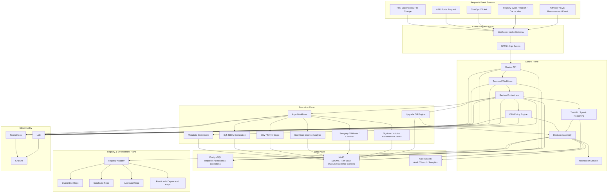

## 36.2 Executive Architecture Diagram

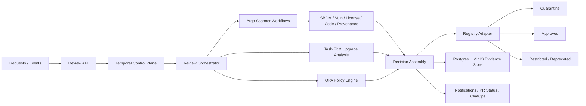

## 36.3 Deployment Topology Diagram

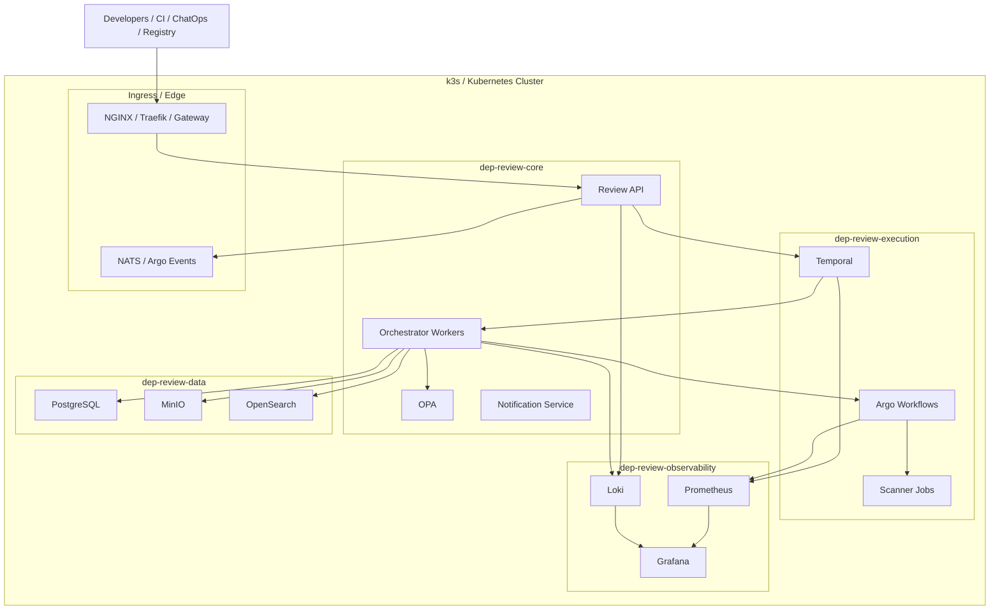

## 36.4 Temporal and Argo Interaction Diagram

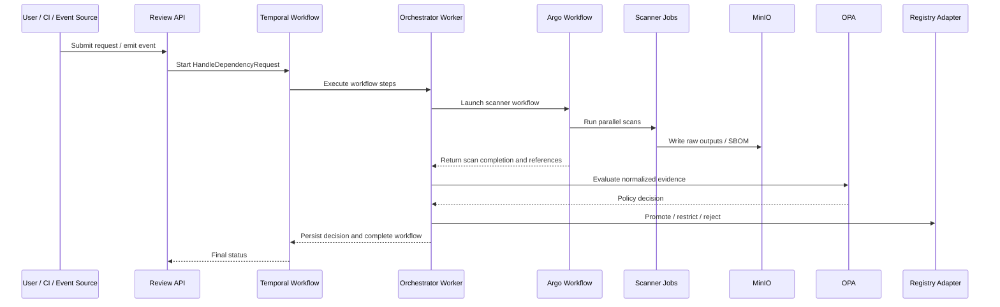

## 36.5 New Package Request Flow

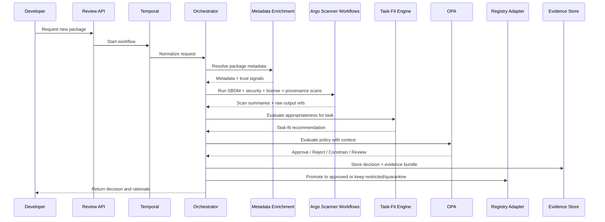

## 36.6 Version Upgrade Request Flow

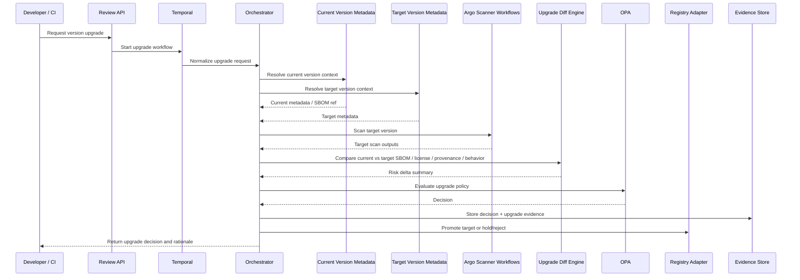

## 36.7 Continuous Reassessment Flow

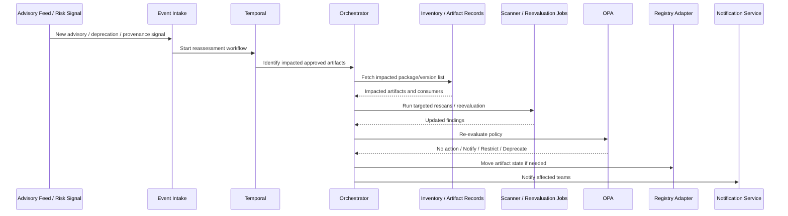

## 36.8 Decision Logic Flow

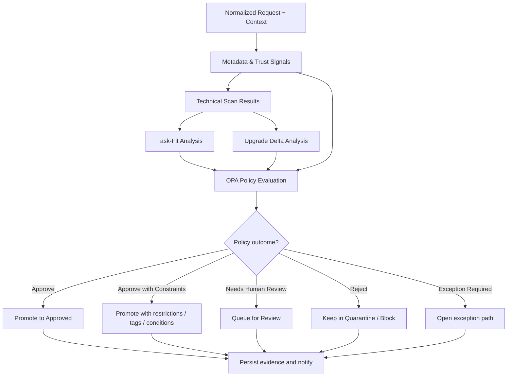

## 36.9 Repository State Transition Diagram

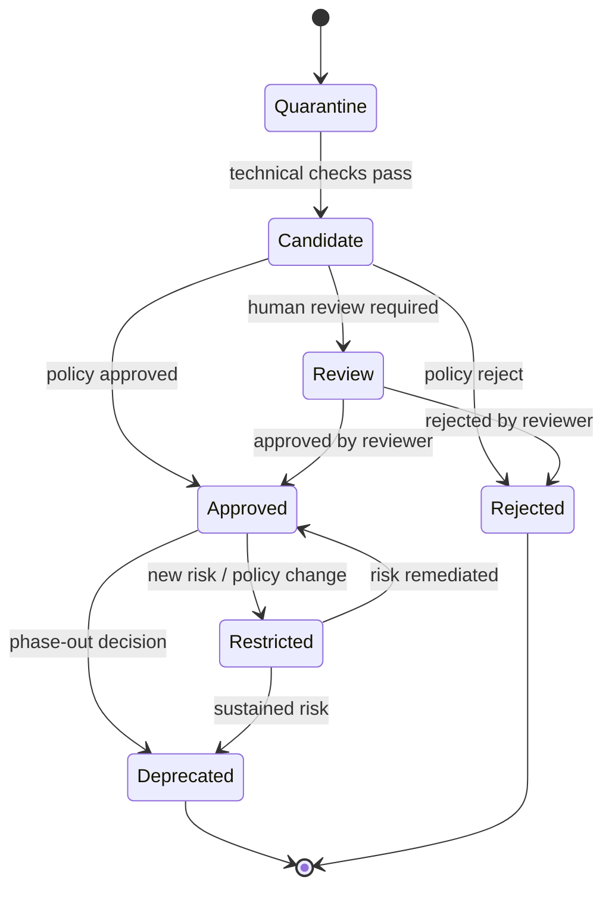

## 36.10 Data and Evidence Flow Diagram

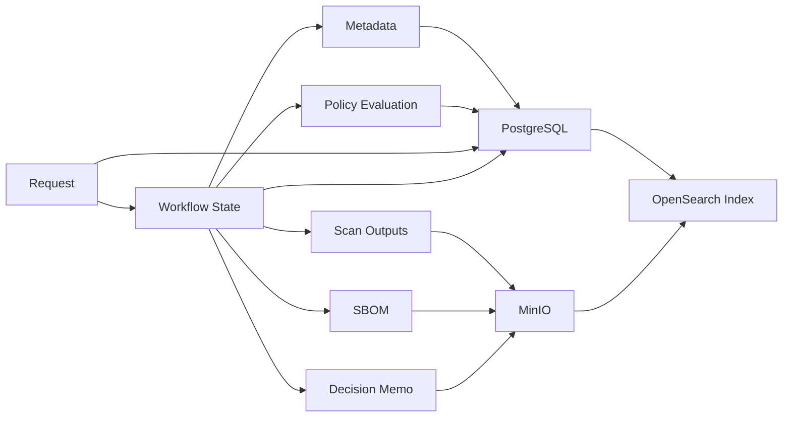

## 36.11 Service Dependency Diagram

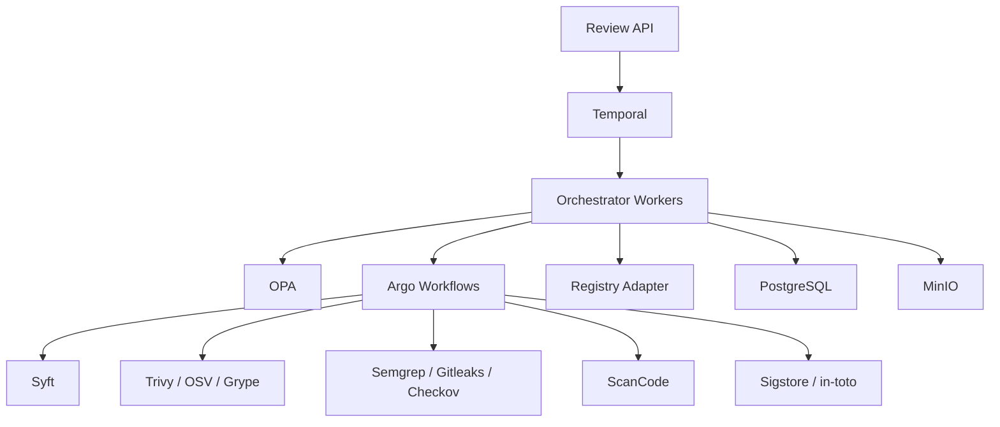

## 36.12 Epic Dependency Diagram

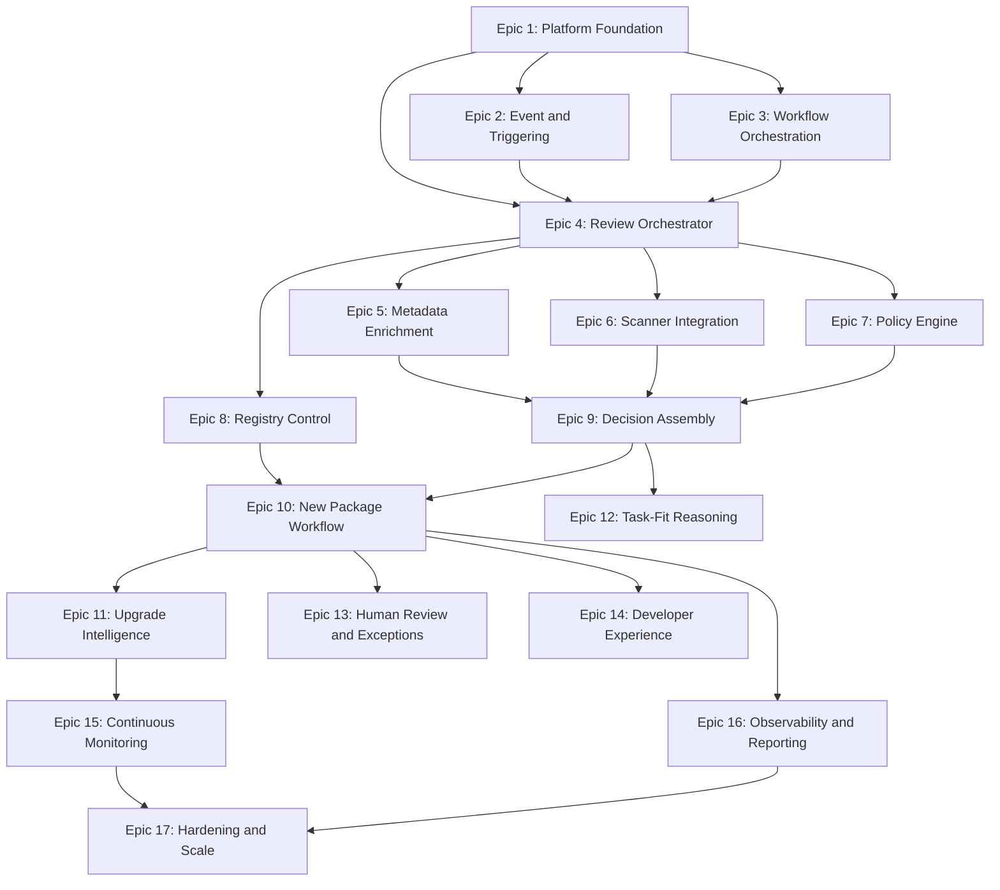

## 36.13 Phase Delivery Diagram

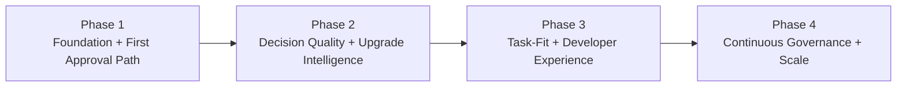

---

End of document.

