# Agentic Dependency Dependency Review — v2

## OSS Architecture, Operating Model, and Phased Implementation Plan

---

# 1. Executive Summary

This document defines a **platform-agnostic, event-driven dependency dependency review system** for governing how third-party software packages and version upgrades are approved for use.

The core objective is to move dependency security from a **reactive scanning model** to a **proactive eedom model**.

Instead of discovering problems after developers have already adopted dependencies, the system evaluates requests **before** packages or upgrades are broadly consumable in the environment.

This system is designed to:

- evaluate **new package requests**
- evaluate **version upgrade requests**
- enforce **standard security and compliance controls**
- assess **appropriateness for the stated task**
- produce **durable, auditable decisions**
- support **ongoing reassessment** after approval

The architecture is explicitly **not tied to any single artifact backend**. Any package management or repository system can serve as the artifact backend if it supports, directly or indirectly:

- event or request integration
- staged promotion or controlled access
- separation between approved and unapproved artifacts

### What changed from v1

This revision preserves the north-star architecture from v1 but fundamentally reworks how we get there:

- **Phase 0 is a Jenkins CI proof of concept** — no new infrastructure, no new cluster, no Temporal, no Argo. Dependency review runs as a Jenkins pipeline using existing CI infrastructure.
- **Build-vs-buy analysis added** — existing tools cover ~60% of the capability stack. We build only the differentiated value and compose the rest.
- **Three operating modes from day one** — monitor, advise, enforce. Launch in monitor. Graduate to enforce per-team, not org-wide.
- **Team sizing and operational cost** explicitly stated per phase.
- **Fail-open by default** with designed bypass and rollback.
- **Organizational readiness** is Phase -1 and a prerequisite, not an afterthought.
- **Product boundary separated from infrastructure** — we assume a cluster exists. We don't build one.

---

# 2. Problem Statement

Modern development teams regularly introduce third-party packages and version upgrades to accelerate delivery. In practice, those changes often occur with inconsistent or incomplete review. Typical organizational failure modes include:

- dependency approval happens informally through chat or tribal knowledge
- repositories proxy public ecosystems without strong dependency reviews
- version upgrades are treated as routine housekeeping rather than change risk events
- teams optimize for speed and convenience over minimum necessary dependency footprint
- scanners produce findings, but there is no central decision point controlling approval
- approved packages remain approved indefinitely without reassessment
- package choice is reviewed only for security vulnerabilities, not for contextual suitability

These gaps create exposure across several dimensions:

- software supply chain compromise
- malicious or typosquatted packages
- unmaintained dependencies
- license incompatibility
- excessive dependency trees
- risky install-time behavior
- overpowered libraries used for simple tasks
- lack of provenance and signing
- upgrade-driven risk changes

The target state is a system where:

> Nothing becomes generally consumable in the internal development environment without passing through a consistent, explainable, and auditable dependency review process.

---

# 3. Goals and Non-Goals

## 3.1 Goals

1. **Standardize dependency approval** — one control plane for package and upgrade decisions
2. **Support event-driven initiation** — evaluation starts as soon as a request or triggering event occurs
3. **Support multiple trigger sources** — PRs, APIs, portals, registry events, ChatOps
4. **Support multiple ecosystems** — npm, PyPI, Maven, Go modules, Cargo, OCI/Helm where relevant
5. **Enforce policy as code** — deterministic allow/deny/conditional decisions via OPA
6. **Add contextual reasoning** — "Is this package appropriate for the task?" / "Does this upgrade materially increase risk?"
7. **Generate evidence** — machine-readable records and human-readable summaries
8. **Continuously reassess approved artifacts** — re-scan on new advisories or periodic schedules
9. **Minimize developer friction** — clear status, explainable outcomes, bounded review time
10. **Deliver value before infrastructure** — prove the model works in existing CI before building a platform

## 3.2 Non-Goals

1. Replace all existing scanners with a new scanner.
2. Solve all software supply chain risk categories in one release.
3. Let an LLM make final approval decisions.
4. Build a fully custom repository manager from scratch.
5. Require one artifact backend vendor.
6. Build a dedicated cluster or platform as a prerequisite for proving value.

---

# 4. Core Concept

## 4.1 Dependency Dependency Review

The closest conceptual analogue is **Kubernetes Dependency Review**.

In Kubernetes, requests to create or modify objects are intercepted before acceptance. Policies validate or mutate the request, and the cluster either accepts or rejects the object.

This system applies the same mental model to software dependencies.

| Kubernetes                          | This System                               |
| ----------------------------------- | ----------------------------------------- |
| API request to create/update object | Request to add package or upgrade version |
| Review webhook                   | Review orchestrator                    |
| Policy engine                       | OPA policy evaluation                     |
| Allow / deny / mutate               | Approve / reject / constrain              |
| Cluster state                       | Internal artifact availability state      |

The result is a **Dependency Dependency Reviewler**.

## 4.2 Why this is different from standard scanning

Standard dependency scanning typically answers:

- Does the package have known vulnerabilities?
- Does the repo currently contain problematic dependencies?

This system must answer broader questions:

- Should this package be allowed at all?
- Is it proportionate to the use case?
- Is it overpowered or unnecessary?
- Is there a safer approved alternative?
- Is the requested upgrade introducing new behaviors or trust concerns?
- Should approval be constrained by environment, scope, or usage mode?

---

# 5. Design Principles

1. **Prove value before building infrastructure** — the PoC runs on existing Jenkins, not a new cluster
2. **Event-driven first** — requests and changes should trigger evaluation immediately
3. **Repository-agnostic** — Artifactory, Nexus, Harbor, GitHub Packages, CodeArtifact, or internal proxies can all fit
4. **Reasoning is advisory; policy is authoritative** — agentic/LLM analysis informs decisions; OPA and deterministic rules enforce decisions
5. **Review before broad consumption** — packages may exist in quarantine, but not in approved repositories until a decision is made
6. **Upgrades are first-class risk events** — version bumps are not treated as routine by default
7. **Auditability by default** — every decision should have an evidence trail
8. **Progressive automation** — start with human review and narrow auto-approvals; expand automation as confidence increases
9. **Fail-open by default** — the system must never silently halt developer productivity; enforcement is earned through trust
10. **Developer experience matters** — controls that are opaque or slow will be bypassed
11. **Build only what doesn't exist** — compose existing scanners and tools; build the orchestration, policy, and reasoning layer

---

# 6. Operating Modes

The system must support three operating modes from day one. This is non-negotiable for organizational adoption and blast radius control.

## 6.1 Monitor Mode

- All dependency changes are analyzed and decisions are recorded
- No blocking occurs — developers are not impacted
- Decisions are logged to the decision database
- Dashboards show what would have been blocked
- Purpose: baseline data collection, policy tuning, false positive discovery

## 6.2 Advise Mode

- All dependency changes are analyzed and decisions are recorded
- Non-blocking warnings are surfaced to developers (PR comments, Slack notifications, Jenkins build warnings)
- Developers can proceed despite warnings
- Purpose: visibility without friction, adoption building, feedback collection

## 6.3 Enforce Mode

- Dependency changes that violate policy are blocked
- Approved alternatives are surfaced with rejections
- Exception and bypass paths are available
- Purpose: actual dependency review

## 6.4 Mode Transition Rules

- Launch in **monitor mode** org-wide
- Graduate to **advise mode** per-team after 2 weeks of clean data
- Graduate to **enforce mode** per-team only with:
  - team opt-in or executive mandate
  - approved alternatives catalog populated for the team's ecosystem
  - exception and bypass paths tested and documented
  - latency SLA met (auto-decisions under 3 minutes)
- Any team can be rolled back to advise or monitor mode at any time
- Emergency bypass (Section 6.5) is always available regardless of mode

## 6.5 Emergency Bypass

When the system is unavailable or producing false positives at scale:

- **Automatic bypass**: if the review pipeline does not return a decision within the configured timeout (default: 5 minutes), the dependency change proceeds with a logged `BYPASS_TIMEOUT` decision
- **Manual bypass**: authorized users can invoke a bypass command (CLI, API, or Jenkins parameter) that logs a `BYPASS_MANUAL` decision with the invoker's identity and stated reason
- **Kill switch**: platform operators can set the entire system to monitor mode via a single configuration change, restoring full developer autonomy immediately
- All bypass events are logged, auditable, and included in dashboards

---

# 7. Build-vs-Buy Analysis

## 7.1 Capabilities well-covered by existing OSS tools

These capabilities exist in mature, well-maintained open-source tools. We should compose them, not rebuild them.

| Capability | Recommended Tool(s) | Maturity |
|---|---|---|
| Vulnerability scanning | OSV-Scanner, Trivy, Grype | High |
| SBOM generation | Syft | High |
| Secret detection | Gitleaks | High |
| Code pattern inspection | Semgrep | High |
| License analysis | ScanCode Toolkit | High |
| Policy-as-code engine | OPA | High |
| Artifact storage/proxy | Nexus OSS, Harbor | High |
| IaC analysis | Checkov | High |
| Supply chain signing | Sigstore cosign | Medium-High |

**Decision**: Use these tools as-is. Do not rebuild any of these capabilities. Integrate them as scanner backends.

## 7.2 Capabilities partially covered

| Capability | Existing Coverage | Gap |
|---|---|---|
| Repository firewall / quarantine | Nexus Pro, JFrog Xray | OSS options require manual configuration; no event-driven review workflow |
| Policy gates on dependencies | Xray, Sonatype Lifecycle | Proprietary, vendor-locked, limited contextual reasoning |
| SBOM diff / upgrade analysis | None turnkey | Individual tools exist but no unified upgrade-risk workflow |

**Decision**: Build the orchestration layer that composes these tools into a unified workflow.

## 7.3 Capabilities largely uncovered — our differentiated value

| Capability | Market Status |
|---|---|
| Task-fit / intent-aware dependency reasoning | No existing solution |
| Centralized, event-driven dependency dependency review plane | No turnkey OSS solution |
| Upgrade risk delta analysis as a first-class workflow | No unified solution |
| Explainable decision memos composing scanner + policy + context | No existing solution |
| Three-mode (monitor/advise/enforce) progressive rollout | No existing solution |

**Decision**: This is what we build. Everything else is composition.

## 7.4 Commercial alternative comparison

| Approach | Covers | Doesn't Cover | Cost Model | Lock-in Risk |
|---|---|---|---|---|
| Sonatype Lifecycle + Firewall | Vuln scanning, license, quarantine, policy | Task-fit, upgrade intelligence, unified control plane | Per-developer licensing | High (proprietary policy engine) |
| JFrog Xray + Advanced Security | Vuln scanning, license, contextual analysis, secrets | Task-fit reasoning, event-driven review workflow | Platform licensing | High (Artifactory-coupled) |
| This system (OSS) | Everything above + task-fit + upgrade intelligence + dependency review | Requires build + ops investment | Infrastructure + team cost | None (OSS stack) |

**Recommendation**: If the organization wants task-fit reasoning, upgrade intelligence, and vendor independence, build this system. If the organization only needs vulnerability scanning and basic policy gates, buy Sonatype or JFrog — it's cheaper and faster.

---

# 8. System Scope

## 8.1 In Scope (Product)

- package request intake and normalization
- version upgrade request intake
- scanner orchestration and result aggregation
- metadata enrichment
- SBOM generation and diffing
- license evaluation
- provenance and signing checks
- policy enforcement (OPA)
- task-fit reasoning (advisory)
- decision assembly and evidence generation
- registry promotion and restriction
- approval memo generation
- continuous reassessment
- developer-facing status and feedback
- operating mode management (monitor/advise/enforce)
- emergency bypass with audit trail

## 8.2 In Scope (Composition — use existing tools, do not rebuild)

- vulnerability scanning (OSV-Scanner, Trivy)
- SBOM generation (Syft)
- secret detection (Gitleaks)
- code pattern inspection (Semgrep)
- license scanning (ScanCode Toolkit)
- artifact storage and proxying (Nexus OSS / Harbor)
- policy engine (OPA)

## 8.3 Out of Scope

- cluster provisioning (prerequisite, not product)
- automatic source code remediation
- mandatory deep dynamic runtime analysis for every package
- rewriting dependency manifests automatically
- replacing all app-team CI pipelines
- enterprise-wide procurement/commercial review workflows

## 8.4 Infrastructure Prerequisites

The following are assumed to exist before product development begins. If they don't exist, provisioning them is a separate infrastructure initiative, not an epic in this plan.

- Kubernetes cluster or equivalent container runtime (for later phases)
- Jenkins CI (for PoC phase — assumed to exist)
- PostgreSQL instance (can be provisioned quickly but is not a product epic)
- Object storage (MinIO or equivalent)

---

# 9. Prior Art and Market Landscape

## 9.1 Closest Conceptual Prior Art

### Kubernetes dependency reviewlers

Examples: OPA Gatekeeper, Kyverno

These are the strongest conceptual precedent because they enforce policy before acceptance.

### Software supply chain security platforms

Examples: Snyk, Mend, Sonatype Lifecycle/Firewall, JFrog Xray

These provide parts of the capability stack: vulnerability scanning, policy enforcement, blocking or quarantining.

### Supply chain integrity projects

Examples: Sigstore, in-toto, SLSA-aligned practices, GUAC

These establish provenance and evidence but do not independently solve contextual package review.

## 9.2 Coverage vs gap

### Well-covered in the market

- vulnerability scanning, secret scanning, static code analysis
- SBOM generation
- artifact storage and proxying
- basic policy gates

### Partially covered

- repository firewall behavior
- blocking known bad packages pre-consumption
- policy-as-code overlays

### Largely uncovered and differentiated

- task-fit / intent-aware dependency reasoning
- centralized, event-driven dependency dependency review
- upgrade risk delta analysis as a first-class workflow
- explainable, unified decision control plane that composes scanners and policy
- progressive rollout with monitor/advise/enforce modes

## 9.3 Positioning statement

> Kubernetes-style dependency review for software dependencies, implemented as an event-driven, policy-enforced control plane with contextual risk reasoning and progressive enforcement.

---

# 10. Event-Driven Operating Model

## 10.1 Core principle

The system is **event-first**, not repository-first.

The artifact backend is important, but it is not the defining architectural element. The defining element is the presence of a programmatic signal that indicates:

- a new package is requested
- a new version is requested
- an unknown dependency appears
- a new advisory affects an already approved package

## 10.2 Supported trigger patterns

### Pattern A: SCM-driven (Phase 0 — PoC)

A pull request or merge request changes dependency files:

- package.json, requirements.txt, poetry.lock, pom.xml, build.gradle, go.mod, Cargo.toml, Helm chart or OCI references

This is the **primary trigger for the Jenkins PoC**. A Jenkins pipeline detects dependency file changes in the changeset and initiates evaluation.

Advantages:

- zero new infrastructure required
- strong auditability via existing CI
- natural fit with existing SDLC
- easiest adoption path

Disadvantages:

- context may be incomplete unless PR templates are enforced

### Pattern B: Request-first (Phase 2+)

A developer requests a package or version through API, portal form, ChatOps bot, or ticket-backed service request.

Advantages:

- strong context capture
- explicit approval history
- easiest to enrich with business justification

Disadvantages:

- requires developer process adoption

### Pattern C: Registry-driven (Phase 3+)

A repository manager or proxy emits an event when a package is uploaded, a remote cache miss occurs, a promotion request is made, or a new version is mirrored.

Advantages:

- close to the artifact control point
- high automation potential

Disadvantages:

- less business context
- can be operationally more complex

### Pattern D: Advisory-driven reevaluation (Phase 3+)

A new vulnerability, deprecation, or trust signal appears for an approved package.

Advantages:

- supports continuous reassessment

Disadvantages:

- requires watcher services and deduplication

## 10.3 Architectural rule

> Trigger source, policy source, and enforcement point must be decoupled.

Examples:

- Jenkins pipeline is a trigger
- OPA is the policy engine
- Nexus/Harbor repository stages are the enforcement point (later phases)
- Jenkins build status is the enforcement point (PoC phase)

---

# 11. Dual Control Points

Strong implementations enforce **two distinct control points**.

## 11.1 Control Point A: Intake / Approval

Purpose: evaluate whether the package or version should be permitted.

Responsibilities:

- metadata enrichment
- scanning
- reasoning
- policy enforcement
- evidence generation

In PoC: implemented as Jenkins pipeline stages.

## 11.2 Control Point B: Consumption / Resolution

Purpose: ensure only approved artifacts are resolvable by default.

Responsibilities:

- repository separation
- access controls
- approved repo promotion
- blocking unapproved sources

In PoC: not enforced. Control Point A runs in advise/monitor mode.
In later phases: enforced via registry stage separation.

Without Control Point B, developers can often bypass the approval process by fetching directly from public registries or unapproved mirrors. This is acceptable during PoC and early adoption, and is the reason we track bypass rates as a metric.

---

# 12. Repository-Agnostic Model

## 12.1 Supported backends

This design can operate with:

- Artifactory, Nexus OSS / Nexus Pro, Harbor, GitHub Packages, AWS CodeArtifact, Azure Artifacts, custom internal proxies

## 12.2 Required backend capabilities (for enforcement phases)

A backend or adapter layer must support, directly or indirectly:

- repository stage separation or an equivalent access model
- API control or automation hooks
- package storage or proxying
- promotion or routing control
- consumer restriction to approved sources

## 12.3 Repository states

A standard set of logical stages is recommended:

- **quarantine**: newly requested or ingested artifacts under evaluation
- **candidate**: artifacts that passed technical checks but may still need approval
- **approved**: generally consumable artifacts
- **restricted**: previously approved artifacts that now require caution or exception
- **deprecated**: no longer approved for new use

In PoC: these states are tracked in the database only. No registry enforcement.

---

# 13. Technology Stack

## 13.1 PoC Stack (Phase 0)

The PoC runs on existing infrastructure. No new cluster, no new platform.

| Component | Technology | Notes |
|---|---|---|
| CI/CD | Jenkins (existing) | Pipeline-as-code, shared library |
| Scanners | OSV-Scanner, Trivy, Syft, ScanCode | Installed as Jenkins tools or container steps |
| Policy engine | OPA (CLI mode) | Runs as a pipeline step, no server required |
| Decision storage | PostgreSQL | Existing instance or lightweight new instance |
| Evidence storage | Local filesystem or S3-compatible | MinIO or existing object store |
| Notification | Jenkins build results + PR comments | Via Jenkins GitHub/GitLab plugin |
| Task-fit advisory | LLM API call (optional) | Lightweight, non-blocking, can be disabled |

Total new infrastructure for PoC: **zero to one** (Postgres if not already available).

## 13.2 Phase 1 Stack (Service Extraction)

When the PoC proves value and the organization commits to the platform:

| Component | Technology | Notes |
|---|---|---|
| Orchestrator | Go or Python (FastAPI) | Single-process service, no distributed workflow engine yet |
| API | REST, integrated with orchestrator | Intake + status + decision retrieval |
| Scanners | Same as PoC | Invoked as subprocesses or container jobs |
| Policy engine | OPA (server mode) | Shared policy service |
| Decision storage | PostgreSQL | Same instance, expanded schema |
| Evidence storage | MinIO | Dedicated bucket per request |
| Notification | Webhook-based | Slack, PR comments, email |
| Event intake | Webhook receiver | Simple HTTP endpoint for Jenkins, GitHub, GitLab webhooks |

## 13.3 Phase 2 Stack (Durable Orchestration)

When workflow complexity and reliability requirements justify it:

| Component | Technology | Notes |
|---|---|---|
| Workflow engine | Temporal | Durable execution, retries, timeouts, compensation |
| Scanner execution | Argo Workflows (optional) | Parallel container-based scan jobs |
| Event bus | NATS | Lightweight event routing |
| Search/audit | OpenSearch | Decision and evidence search |
| Observability | Prometheus + Grafana + Loki | Metrics, dashboards, logs |

## 13.4 Phase 3 Stack (Full Platform)

| Component | Technology | Notes |
|---|---|---|
| Registry enforcement | Nexus OSS or Harbor | Quarantine/approved/restricted repos |
| Provenance | Sigstore cosign, in-toto | Signature verification |
| Evidence graph | GUAC | Dependency graph intelligence |
| Advanced scanners | Semgrep, Gitleaks, Checkov | Conditional execution by artifact type |

## 13.5 Scanner and analysis components (full list)

### Vulnerability analysis

- OSV-Scanner (Phase 0)
- Trivy (Phase 0)
- Grype (Phase 2, for correlation/second-pass coverage)

### SBOM generation

- Syft (Phase 0)

### Secret detection

- Gitleaks (Phase 1)

### Code pattern inspection

- Semgrep (Phase 2)

### IaC analysis

- Checkov (Phase 3, conditional on IaC content)

### License analysis

- ScanCode Toolkit (Phase 0)

### Supply chain integrity

- Sigstore cosign (Phase 3)
- in-toto (Phase 3)
- Rekor where appropriate (Phase 3)

### Dependency graph / evidence graph

- GUAC (Phase 3)

---

# 14. Fail-Open / Fail-Closed Design

This section is mandatory reading for anyone deploying or operating the system.

## 14.1 Default behavior: fail-open

The system defaults to **fail-open** in all phases. This means:

- If a scanner fails or times out, the workflow continues without that scanner's results. The decision memo notes the missing scanner output.
- If the OPA policy evaluation fails, the request is marked `NEEDS_HUMAN_REVIEW` — it is not auto-rejected.
- If the orchestrator service is unavailable, dependency changes proceed normally. No blocking occurs.
- If the Jenkins pipeline step fails, the build continues. The review step is advisory, not a build gate (until enforce mode is enabled for that team).

## 14.2 Fail-closed behavior (opt-in)

Teams in **enforce mode** can opt into fail-closed for specific decision paths:

- known malicious package indicators: always fail-closed regardless of mode
- critical exploitable vulnerabilities in internet-facing runtime dependencies: fail-closed recommended
- forbidden licenses: fail-closed recommended

Fail-closed behavior is never the default. It requires explicit per-team or per-policy opt-in.

## 14.3 Timeout budget

| Stage | Timeout | On Timeout |
|---|---|---|
| Individual scanner | 60 seconds | Skip scanner, note in evidence |
| All scanners combined | 180 seconds | Proceed with partial results |
| OPA evaluation | 10 seconds | Mark NEEDS_HUMAN_REVIEW |
| Task-fit reasoning (LLM) | 30 seconds | Skip reasoning, note in evidence |
| Total pipeline | 300 seconds | Auto-bypass with BYPASS_TIMEOUT decision |

## 14.4 Rollback procedures

| Situation | Action | Who Can Do It |
|---|---|---|
| System producing excessive false positives | Switch affected teams to monitor mode | Platform operators |
| System outage | Kill switch: all teams to monitor mode | Platform operators |
| Single team friction | Switch that team to advise mode | Team lead or platform operators |
| Policy too strict | Update OPA policy bundle and redeploy | Security engineering |
| Full rollback | Disable Jenkins pipeline step or remove webhook | Platform operators, < 5 minutes |

---

# 15. Logical Components in Detail

## 15.1 API / Intake Layer

Functions:

- receive new package requests
- receive version upgrade requests
- receive webhook-triggered requests from PR or registry events
- validate payload schema
- assign request ID
- capture metadata such as requesting team, use case, environment, and scope

In PoC: Jenkins pipeline parses dependency file diffs and constructs request objects internally.

## 15.2 Event Normalization Layer

Purpose: convert heterogeneous triggers into a standard internal request model.

Examples:

- GitHub PR dependency diff → standard package request items
- Jenkins changeset → dependency file diff → request model
- Registry publish event → candidate approval request
- API form submission → direct request model

## 15.3 Package Metadata Enrichment Layer

Responsibilities:

- resolve package identity and ecosystem
- fetch registry metadata
- resolve source repository if present
- inspect release history
- gather maintainer/publisher details
- detect project archival or deprecation
- collect install script metadata where available

In PoC: lightweight — registry metadata only. Full enrichment in Phase 1+.

## 15.4 Scanner Coordination Layer

Responsibilities:

- invoke scanner jobs
- manage retries
- track job status
- normalize outputs into a common evidence model
- support conditional execution by ecosystem and artifact type

In PoC: sequential execution as Jenkins pipeline stages.

## 15.5 Task-Fit Reasoning Layer

Responsibilities:

- assess whether the dependency is proportionate to the requested use case
- identify safer approved alternatives
- assess unnecessary attack surface
- produce an explainable recommendation

This layer can use an LLM, but it must not independently enforce policy.

In PoC: lightweight LLM API call with package metadata + use case context. Non-blocking. Can be disabled entirely. Returns advisory text appended to the decision memo.

## 15.6 Upgrade Diff Layer

Responsibilities:

- compare current vs target versions
- compare SBOMs
- identify new transitive dependencies
- identify license changes
- inspect maintainer or provenance changes
- summarize changelog and release-note risk signals

## 15.7 Policy Evaluation Layer

Responsibilities:

- apply deterministic rules
- classify findings
- decide allow / reject / allow with constraints / escalate
- record rule traces and inputs

In PoC: OPA CLI evaluating a policy bundle against normalized scanner output.

## 15.8 Registry Adapter Layer (Phase 2+)

Responsibilities:

- push artifact/version into quarantine
- promote approved versions
- move artifacts to restricted/deprecated states
- configure or use repository paths accordingly

Not present in PoC or Phase 1. Registry enforcement begins in Phase 2.

## 15.9 Evidence and Audit Layer

Responsibilities:

- persist raw scanner outputs
- persist normalized evidence
- store approval memos
- store policy decisions and exceptions
- support audit queries and search

In PoC: JSON files in object storage, decision records in Postgres.

---

# 16. Data Model (Logical)

## 16.1 Core entities

### Request

Represents a request to admit or upgrade a dependency.

Fields:

- request_id, request_type (new_package, upgrade, reapproval, exception)
- submitted_by, team, service/application, environment_sensitivity
- ecosystem, package_name, current_version, target_version
- scope (runtime, build, dev), use_case, business_justification
- status, operating_mode (monitor, advise, enforce)
- created_at, updated_at

### Artifact Record

Represents a package/version under management.

Fields:

- ecosystem, package_name, version, artifact_locator
- source_repo_url, publisher, maintainer_summary
- first_seen_at, current_state, latest_decision_id

### Scan Result

Represents an individual tool execution result.

Fields:

- scan_result_id, request_id, tool_name, artifact_reference
- started_at, completed_at, status (success, failed, timeout, skipped)
- normalized_summary, raw_output_location

### Policy Evaluation

Represents deterministic rule evaluation.

Fields:

- evaluation_id, request_id, policy_bundle_version
- decision, constraints, triggered_rules, rule_trace_location

### Evidence Bundle

Represents the full package of decision artifacts.

Fields:

- evidence_bundle_id, request_id
- sbom_location, upgrade_diff_location
- policy_evaluation_id, decision_memo_location
- created_at

### Exception

Represents an approved deviation.

Fields:

- exception_id, request_id, approver, rationale
- expiration_date, compensating_controls, status

### Bypass Record

Represents a bypass event.

Fields:

- bypass_id, request_id, bypass_type (timeout, manual, kill_switch)
- invoked_by, reason, timestamp

---

# 17. Interfaces and Request Schemas

## 17.1 New package request schema (illustrative)

```json
{
  "request_type": "new_package",
  "ecosystem": "npm",
  "package_name": "example-lib",
  "target_version": "2.4.1",
  "team": "customer-platform",
  "service": "customer-api",
  "scope": "runtime",
  "environment_sensitivity": "internet-facing",
  "use_case": "JWT parsing",
  "business_justification": "Need standards-compliant token validation",
  "operating_mode": "advise"
}
```

## 17.2 Version upgrade request schema (illustrative)

```json
{
  "request_type": "upgrade",
  "ecosystem": "python",
  "package_name": "requests",
  "current_version": "2.31.0",
  "target_version": "2.32.3",
  "team": "billing-platform",
  "service": "billing-api",
  "scope": "runtime",
  "environment_sensitivity": "internal-sensitive",
  "use_case": "HTTP client",
  "business_justification": "security and bug fixes",
  "operating_mode": "enforce"
}
```

## 17.3 SCM-derived request enrichment

When requests are created from PR changes, the system should enrich the payload with:

- repository name, PR number, dependency file path, lockfile diff summary
- commit SHA, submitter identity
- CI job ID (Jenkins build number in PoC phase)

---

# 18. Workflow Definitions

## 18.1 New Package Workflow

### Step 1: Intake

- validate schema
- assign request ID
- persist request
- determine operating mode for the requesting team

### Step 2: Metadata enrichment

- resolve package and version metadata
- find repository/source
- inspect release history
- gather trust signals

### Step 3: Technical analysis

- generate SBOM
- run vulnerability scans
- run license scan
- run provenance checks (if available)
- run secret/code pattern scans where applicable
- enforce per-scanner timeouts; skip and note on timeout

### Step 4: Contextual analysis

- analyze task fit (advisory, non-blocking)
- look for existing approved alternatives
- estimate attack surface and dependency footprint

### Step 5: Policy evaluation

- send normalized evidence to OPA
- compute deterministic decision
- if OPA fails: mark NEEDS_HUMAN_REVIEW

### Step 6: Decision assembly

- produce machine-readable decision
- produce human-readable decision memo
- determine constraints if conditional approval

### Step 7: Mode-aware enforcement

- **Monitor mode**: log decision, no developer-facing action
- **Advise mode**: post PR comment with findings and recommendation, mark build as unstable (not failed) if concerns exist
- **Enforce mode**: block PR merge / fail build if policy rejects; allow if policy approves

### Step 8: Notification and closeout

- notify requester (mode-appropriate)
- attach evidence references
- create ticket/comment/status update as needed

## 18.2 Version Upgrade Workflow

Same structure as 18.1 with additions:

- baseline collection for current and target versions
- dual SBOM generation and diff
- upgrade risk delta computation
- changelog/release note summarization
- upgrade-specific policy rules

## 18.3 Continuous Reassessment Workflow (Phase 3+)

Triggers:

- new advisory, new EPSS/exploitation signal
- package deprecation
- publisher or provenance change signals
- scheduled rescan

Possible outcomes:

- no action
- notify consumers
- move artifact to restricted
- create forced upgrade recommendation
- require re-approval for future use

---

# 19. Risk Model

## 19.1 Risk dimensions

The system evaluates risk across multiple independent dimensions:

- **Vulnerability risk**: CVSS severity, exploit maturity, reachability, fix availability
- **Supply chain trust risk**: provenance, signature, publisher trust, maintainer churn, repo archival
- **Operational risk**: dependency graph depth, native extensions, install scripts, transitive count
- **Compliance risk**: license incompatibility, export control where applicable
- **Context risk**: runtime vs dev-only, internet-facing, data sensitivity, privileged environment
- **Appropriateness risk**: mismatch between need and package scope, safer alternatives exist, standard library sufficiency

## 19.2 Hard reject conditions (enforce mode only)

- known malicious package indicators
- critical exploitable vulnerabilities in reachable paths for sensitive runtime contexts
- forbidden or incompatible license
- detected typosquatting or namespace confusion signal above threshold
- missing provenance/signature where policy requires it
- dangerous install-time network execution in high-sensitivity contexts

## 19.3 Conditional approval patterns

- build-time only approval
- dev/test only approval
- pinned exact version required
- sandbox-only usage
- explicit exception expiry

---

# 20. Task-Fit Evaluation Framework

This is the most differentiated part of the system.

## 20.1 Core question

> Is this the right dependency for the stated task in this context?

## 20.2 Evaluation dimensions

| Dimension | Guidance |
|---|---|
| Necessity | Is a dependency required at all? |
| Minimality | Is this the narrowest reasonable dependency? |
| Maintainability | Is the project active, stable, and understandable? |
| Security posture | Does it show healthy supply-chain and secure coding signals? |
| Runtime exposure | Will it process untrusted input, secrets, or sensitive data? |
| Operational blast radius | How much transitive complexity does it add? |
| Alternative availability | Is there a safer approved or built-in option? |
| Behavioral concerns | Does it execute code, shell out, fetch network resources, or use plugins? |

## 20.3 Cold Start Bootstrap

The task-fit layer is only useful when the approved-alternatives catalog is populated. Without it, every "poor fit" assessment is friction without guidance.

**Bootstrap plan (required before advise or enforce mode):**

1. Inventory the organization's top 50 most-used packages per ecosystem (from lockfile analysis across repos)
2. Auto-approve these as the initial approved catalog
3. For each approved package, record its primary use case category
4. Seed the alternatives mapping: for each category, list the approved options
5. Expand the catalog as new packages are approved through the review process

This bootstrap is a **prerequisite** for transitioning any team to advise or enforce mode. It should be completed during the PoC phase using existing lockfile data.

## 20.4 Example outcomes

- **Acceptable**: mature narrow-purpose library, small dependency tree, appropriate for task, no better approved alternative
- **Acceptable with caution**: package is appropriate but introduces moderate complexity; approve with scope limits or version pinning
- **Poor fit**: package is significantly broader than needed; better approved option exists
- **Reject**: package introduces unnecessary risk for low-complexity need; active trust or security concerns

---

# 21. Upgrade Intelligence Framework

## 21.1 Why upgrades require separate treatment

Version upgrades often get less scrutiny than net-new dependencies, yet they can introduce:

- new transitive dependencies
- new install-time behavior
- changed maintainers or publisher trust patterns
- changed licenses
- new telemetry or outbound behavior
- major API or runtime changes with security impact

## 21.2 Risk delta categories

### Low delta

- small patch release, no new dependencies, no license/provenance changes
- vulnerability posture improves or remains stable
- **Auto-approval candidate in enforce mode**

### Medium delta

- some new transitive dependencies, behavior changes limited but non-trivial
- sensitivity of consuming app increases concern
- **Human review recommended**

### High delta

- major version change, new install scripts or native bindings
- significant dependency tree expansion, provenance changes or maintainer handoff
- **Human review required**

## 21.3 Upgrade-specific policy examples

- auto-approve low-delta patch upgrades from trusted publishers for dev/build scopes
- require review for all major runtime upgrades in internet-facing services
- block upgrades that introduce forbidden licenses or unsigned provenance

---

# 22. Agentic Layer Design

## 22.1 Purpose

The agentic layer exists to synthesize, interpret, and explain evidence. It does not independently enforce access.

## 22.2 Suitable responsibilities

- summarize scanner outputs into a concise memo
- assess task fit using request context
- compare against known alternatives
- interpret changelogs and release notes
- draft human-readable approval rationale
- draft developer-facing rejection guidance

## 22.3 Unsuitable responsibilities

- final allow/deny enforcement
- bypassing OPA or policy traces
- making silent exceptions
- overriding mandatory reject conditions

## 22.4 Design constraints

- every recommendation must be explainable
- final policy decision must remain deterministic (OPA)
- prompts and outputs should be versioned
- model usage must be optional and degradable

## 22.5 Failure handling

If the agentic layer is unavailable:

- technical scanning and OPA policy continue
- the decision memo omits the task-fit section
- the decision is not affected — only the explanation quality degrades
- workflows never block on LLM availability

---

# 23. Decision Framework

## 23.1 Decision outcomes

- **Approve**: artifact/version promoted (or logged as approved in monitor/advise mode)
- **Approve with constraints**: allowed only under specific conditions
- **Needs human review**: evidence incomplete or policy requires manual review
- **Reject**: not approved for use (blocking in enforce mode, advisory in advise mode)
- **Exception required**: can only proceed through documented compensating controls and expiration

## 23.2 Decision memo template

Each request should produce a short memo containing:

- what was requested
- where it is intended to be used
- key findings (scanner results summary)
- task-fit summary (if available)
- upgrade delta summary (if applicable)
- safer alternatives (if relevant)
- final decision
- constraints or next steps
- operating mode in effect
- any scanner timeouts or skips

## 23.3 Machine-readable decision record

Fields:

- request_id, decision, risk_score, risk_dimensions
- triggered_policies, constraints, evidence_bundle_id
- reviewer (if manual), effective_date
- expiration/review_date (if applicable)
- operating_mode, bypass_info (if applicable)

---

# 24. Auto-Approval Strategy

## 24.1 Safe early auto-approval candidates

- patch upgrades from trusted publishers
- no new dependencies, no license changes
- no critical/high blocking findings
- low-sensitivity usage context
- provenance passes where required

## 24.2 Mandatory review candidates

- net-new packages (always in early phases)
- major runtime version upgrades
- crypto/auth/serialization/parsing libraries
- packages used by internet-facing or regulated workloads
- dependencies introducing native code or shell/network install scripts
- high-transitive-footprint packages

## 24.3 Maturity path

- **Phase 0 (PoC)**: no auto-approval; all decisions are advisory
- **Phase 1**: manual review with strong evidence automation
- **Phase 2**: auto-approve low-risk upgrades in enforce mode
- **Phase 3**: auto-approve low-risk new packages in low-sensitivity contexts

---

# 25. Developer Experience Model

## 25.1 Principles

- fast feedback (target: under 3 minutes for auto-decisions)
- explainable outcomes (every rejection includes why + what to do instead)
- minimal duplicate data entry
- support for PR-native workflows
- status visibility throughout the request lifecycle
- bypass paths are visible, not hidden

## 25.2 Interfaces by phase

### Phase 0 (PoC)

- Jenkins build results (pass/warn/fail)
- PR comments via Jenkins plugin
- Decision log in Postgres (queryable by platform team)

### Phase 1

- REST API
- CLI wrapper for common request flows
- PR comments and checks
- Slack notifications

### Phase 2+

- lightweight web UI for status and evidence browsing
- ChatOps integration for status and approvals
- approved alternatives discovery experience
- API documentation

## 25.3 Required developer-facing outputs

- current status
- estimated next action (waiting for scans, waiting for review, approved, rejected)
- top findings summary
- links to evidence bundle or condensed evidence view
- remediation guidance (what to do if rejected)
- approved alternatives (if rejection is based on task fit)

## 25.4 Adoption risk mitigation

The biggest non-technical risk is workflow bypass. Teams will bypass if:

- approvals take too long → **mitigation**: 3-minute SLA for auto-decisions, monitor mode as default
- rejection rationale is vague → **mitigation**: every rejection includes specific findings and alternatives
- there is no clear path to exception → **mitigation**: exception and bypass paths documented and accessible from day one
- approved alternatives are not discoverable → **mitigation**: alternatives catalog bootstrapped before enforce mode

---

# 26. Security and Governance Operating Model

## 26.1 Roles

### Platform engineering

- operate the dependency review system
- maintain Jenkins pipeline (PoC) or orchestrator service (later phases)
- maintain registry integrations
- manage operating mode transitions

### Security engineering

- define and maintain OPA policy bundles
- maintain risk scoring guidance
- review escalations and exceptions
- tune scanner coverage

### Application teams

- submit requests
- provide use case context
- remediate rejected or constrained requests

### Architecture / governance

- approve high-risk exceptions
- adjudicate trade-offs for strategic tools

## 26.2 Responsibility split

| Function | Owner |
|---|---|
| Review system ops | Platform |
| Scanner execution reliability | Platform / Security shared |
| OPA policy rules | Security |
| Approved alternatives catalog | Security / Platform / App enablement shared |
| Exception approvals | Security / Architecture |
| Registry governance | Platform |
| Operating mode transitions | Platform (with team lead agreement) |
| Emergency bypass authorization | Platform operators |

## 26.3 SLAs

| Request Type | Target Latency | Mode |
|---|---|---|
| Auto-approvals (low-risk upgrades) | < 3 minutes | All modes |
| Standard new package (auto-decision) | < 5 minutes | All modes |
| Standard new package (human review) | Same business day | Advise/Enforce |
| High-risk escalation | Defined by severity | Enforce |
| Emergency bypass | Immediate (self-service) | Enforce |

---

# 27. Team Sizing and Operational Cost

## 27.1 Phase 0 (Jenkins PoC)

| Role | Headcount | Duration |
|---|---|---|
| Platform/security engineer (builds pipeline) | 1 | 2-3 weeks |
| Security engineer (writes initial OPA policies) | 0.5 (part-time) | 2-3 weeks |
| **Total** | **1.5 engineers** | **2-3 weeks** |

Ongoing ops: negligible — Jenkins pipeline is self-service.

## 27.2 Phase 1 (Service Extraction)

| Role | Headcount | Duration |
|---|---|---|
| Backend engineer (orchestrator service) | 1-2 | 4-6 weeks |
| Security engineer (policy expansion) | 0.5 | Ongoing |
| **Total** | **2-2.5 engineers** | **4-6 weeks** |

Ongoing ops: ~0.25 FTE for service maintenance.

## 27.3 Phase 2 (Durable Orchestration + Registry Enforcement)

| Role | Headcount | Duration |
|---|---|---|
| Backend engineers | 2-3 | 6-8 weeks |
| Platform engineer (Temporal, Argo, Nexus) | 1 | 6-8 weeks |
| Security engineer | 0.5-1 | Ongoing |
| **Total** | **3.5-5 engineers** | **6-8 weeks** |

Ongoing ops: 1-1.5 FTE for platform + service operations.

## 27.4 Phase 3 (Full Platform)

| Role | Headcount | Duration |
|---|---|---|
| Engineering team | 4-6 | 8-12 weeks |
| Platform/SRE | 1-2 | Ongoing |
| Security engineering | 1 | Ongoing |
| **Total** | **6-9 engineers** | **8-12 weeks** |

Ongoing ops: 2-3 FTE for full platform operations.

## 27.5 Cost comparison

| Approach | Build Cost (engineer-months) | Ongoing Ops (FTE) | Annual Infra | Total Year 1 |
|---|---|---|---|---|
| This system (through Phase 2) | 8-12 eng-months | 1-1.5 FTE | Low (OSS + compute) | Moderate |
| Sonatype Lifecycle | 0.5-1 eng-month (integration) | 0.25 FTE | $50-200K licensing | Moderate-High |
| JFrog Xray + Advanced | 0.5-1 eng-month (integration) | 0.25 FTE | $50-250K licensing | Moderate-High |

**Decision point**: if the organization values vendor independence and the differentiated capabilities (task-fit, upgrade intelligence, dependency review plane), the build cost is justified. If only vulnerability scanning and basic policy gates are needed, buy.

---

# 28. Organizational Readiness (Phase -1)

This is a prerequisite for any phase. It is not optional.

## 28.1 Checklist

- [ ] Executive sponsor identified (VP Engineering or CISO)
- [ ] Pilot team(s) selected (1-2 teams, ideally willing volunteers)
- [ ] Change management plan drafted (how teams will be informed, trained, supported)
- [ ] Approved alternatives catalog bootstrapped (top 50 packages per ecosystem from lockfile analysis)
- [ ] Exception and bypass process documented
- [ ] SLA targets agreed with pilot teams
- [ ] Success metrics defined (see Section 32)
- [ ] Communication plan for rejected dependency requests
- [ ] Feedback channel established (Slack channel, form, or office hours)

## 28.2 Timeline

2-3 weeks, overlapping with Phase 0 engineering work.

## 28.3 Go/no-go criteria for Phase 0 launch

- At least one pilot team has agreed to participate
- Approved alternatives catalog has at least 30 entries per target ecosystem
- Exception process is documented and accessible
- Jenkins pipeline is functional and tested against the pilot team's repository

---

# 29. Epic-Level Implementation Plan

This plan is organized around delivery phases, not a waterfall of 17 sequential epics. Each phase is independently valuable.

## Phase 0: Jenkins PoC (2-3 weeks)

### Epic 0.1: Jenkins Pipeline Foundation

Objective: Build a Jenkins shared library that detects dependency changes and runs review evaluation.

Scope:

- Jenkinsfile shared library with dependency diff detection
- Lockfile/manifest parser for target ecosystem(s) (start with one: npm or PyPI)
- SBOM generation via Syft (pipeline step)
- Vulnerability scan via OSV-Scanner + Trivy (pipeline steps)
- License scan via ScanCode (pipeline step)
- OPA policy evaluation (CLI step)
- Decision record persistence to Postgres
- PR comment with findings summary and decision
- Operating mode support (monitor/advise — enforce deferred to Phase 1)
- Scanner timeout handling (skip and note on timeout)

Outputs:

- working Jenkins pipeline evaluating dependency changes on PRs
- decision database with queryable records
- PR comments with review decisions

### Epic 0.2: Initial Policy Bundle

Objective: Define baseline OPA policies for the PoC ecosystem.

Scope:

- critical/high vulnerability blocking rule
- forbidden license list
- known malicious package list (from OSV)
- maximum transitive dependency count threshold
- package age threshold (no packages published < 90 days)
- policy bundle versioning

Outputs:

- OPA policy bundle covering baseline security and compliance rules

### Epic 0.3: Alternatives Catalog Bootstrap

Objective: Seed the approved alternatives catalog from existing lockfile data.

Scope:

- scan pilot team repositories for lockfiles
- extract and deduplicate package lists
- auto-approve top-used packages as initial catalog
- categorize by use case (HTTP client, JSON parser, auth, etc.)
- build alternatives mapping

Outputs:

- populated alternatives catalog ready for task-fit advisory

### Epic 0.4: Lightweight Task-Fit Advisory (Optional)

Objective: Add non-blocking task-fit commentary to decision memos.

Scope:

- LLM API integration (single call per request)
- package metadata + use case context as input
- advisory text appended to decision memo
- fully optional — can be disabled via config
- 30-second timeout, skip on failure

Outputs:

- task-fit commentary in decision memos (when enabled)

## Phase 1: Service Extraction (4-6 weeks)

### Epic 1.1: Review Orchestrator Service

Objective: Extract the Jenkins pipeline logic into a standalone service.

Scope:

- REST API for request intake, status, and decision retrieval
- request normalization from multiple trigger sources
- scanner coordination (invoke as subprocesses or containers)
- OPA integration (server mode)
- evidence bundle persistence
- notification webhooks
- operating mode management per team

### Epic 1.2: Upgrade Intelligence

Objective: Add first-class version upgrade analysis.

Scope:

- dual SBOM generation and diff
- dependency graph comparison
- license and provenance change detection
- changelog summarization
- risk delta classification (low/medium/high)
- upgrade-specific OPA rules

### Epic 1.3: Human Review Workflow

Objective: Support manual review for escalated requests.

Scope:

- review queue (Slack-based or simple web UI)
- approval/rejection with rationale capture
- exception request and tracking
- exception expiration and renewal

### Epic 1.4: CLI and Developer Tools

Objective: Make the system self-service for developers.

Scope:

- CLI for submitting requests, checking status, browsing decisions
- approved alternatives lookup command
- exception request command

## Phase 2: Durable Orchestration + Registry Enforcement (6-8 weeks)

### Epic 2.1: Temporal Workflow Engine

Objective: Replace single-process orchestration with durable workflows.

Scope:

- deploy Temporal
- migrate orchestrator logic to Temporal workflows and activities
- implement retries, timeouts, and compensation
- child workflows for scanner execution
- workflow observability

### Epic 2.2: Registry Control and Promotion

Objective: Implement enforcement at the artifact registry level.

Scope:

- deploy or integrate Nexus OSS / Harbor
- implement quarantine, candidate, approved, restricted, deprecated states
- registry adapter service
- promotion and restriction API
- consumer access configuration

### Epic 2.3: Event Bus and Multi-Trigger Support

Objective: Support event-driven triggers beyond Jenkins.

Scope:

- deploy NATS
- webhook receiver for GitHub, GitLab, Bitbucket, registry events
- event normalization and deduplication
- idempotent request processing

### Epic 2.4: Observability

Objective: Make the system operable and measurable.

Scope:

- Prometheus metrics
- Grafana dashboards (request volume, latency, approval rates, bypass rates)
- Loki log aggregation
- operating mode dashboard

## Phase 3: Continuous Governance + Scale (8-12 weeks)

### Epic 3.1: Continuous Reassessment

Scope: scheduled rescans, advisory-triggered reevaluation, restricted-state transitions, consumer notifications

### Epic 3.2: Advanced Scanners

Scope: Semgrep, Gitleaks, Checkov (conditional execution), Sigstore provenance verification

### Epic 3.3: Evidence Graph (GUAC)

Scope: dependency graph intelligence, provenance graphing

### Epic 3.4: Performance and Hardening

Scope: worker autoscaling, HA, backpressure, rate limiting, tenancy isolation, DR planning

### Epic 3.5: Search and Audit

Scope: OpenSearch indexing, audit queries, compliance reporting

---

# 30. Delivery Sequencing Summary

```text
Phase -1: Organizational Readiness     [2-3 weeks, overlaps with Phase 0]
  ├── Executive sponsor
  ├── Pilot team selection
  ├── Alternatives catalog bootstrap
  └── Change management plan

Phase 0: Jenkins PoC                   [2-3 weeks, 1.5 engineers]
  ├── Jenkins pipeline (one ecosystem)
  ├── OSV + Trivy + Syft + ScanCode
  ├── OPA policy bundle
  ├── Decision database
  ├── PR comments
  └── Monitor/advise mode

  → GATE: Pilot team runs for 2 weeks in monitor mode
  → GATE: Decision quality reviewed, false positive rate < 15%
  → GATE: Go/no-go for Phase 1

Phase 1: Service Extraction            [4-6 weeks, 2-2.5 engineers]
  ├── Standalone orchestrator service
  ├── Upgrade intelligence
  ├── Human review workflow
  ├── CLI
  └── Enforce mode (per-team opt-in)

  → GATE: 3+ teams onboarded
  → GATE: Auto-decision latency < 3 minutes
  → GATE: Go/no-go for Phase 2

Phase 2: Durable Orchestration         [6-8 weeks, 3.5-5 engineers]
  ├── Temporal
  ├── Registry enforcement (Nexus/Harbor)
  ├── Event bus (NATS)
  ├── Multi-trigger support
  └── Observability stack

  → GATE: >50% of dependency changes flow through system
  → GATE: Registry enforcement validated with pilot team

Phase 3: Full Platform                 [8-12 weeks, 6-9 engineers]
  ├── Continuous reassessment
  ├── Advanced scanners
  ├── GUAC evidence graph
  ├── Performance + hardening
  └── Search + audit
```

---

# 31. Example End-to-End Flows

## 31.1 Example: New package request (PoC — Jenkins)

A developer opens a PR that adds `foo-parser@3.2.1` to `package.json`.

1. Jenkins pipeline triggers on PR.
2. Dependency diff detects new package `foo-parser@3.2.1`.
3. Pipeline constructs request object with repo, PR, team metadata.
4. Syft generates SBOM for the package.
5. OSV-Scanner and Trivy scan for vulnerabilities.
6. ScanCode checks license.
7. OPA evaluates policy against normalized findings.
8. Decision: approve / approve with constraints / needs review / reject.
9. PR comment posted with findings, decision, and alternatives (if rejected).
10. Decision and evidence persisted to Postgres and object storage.
11. Operating mode determines whether the build is marked pass, unstable, or failed.

## 31.2 Example: Version upgrade request (Phase 1+)

A team requests `bar-client` from `1.8.3` to `1.10.0`.

1. Request enters via API or PR.
2. Current and target metadata collected.
3. Dual SBOMs generated and diffed.
4. New transitive dependencies identified.
5. Target version scanned.
6. Changelog summarized.
7. Risk delta scored (low/medium/high).
8. OPA evaluates upgrade-specific policy.
9. Decision enforced per operating mode.

## 31.3 Example: Emergency bypass

A developer's build is blocked by a false positive in enforce mode.

1. Developer runs `dep-admit bypass --request REQ-1234 --reason "false positive on CVE-2025-XXXX, transitive only, not reachable"`.
2. System logs bypass with developer identity, reason, and timestamp.
3. Build proceeds immediately.
4. Bypass appears in dashboard and audit log.
5. Security team reviews bypasses in next triage cycle.

---

# 32. Success Metrics

## 32.1 PoC success criteria (Phase 0)

- pipeline runs on every PR with dependency changes for pilot team
- decision latency < 5 minutes (p95)
- false positive rate < 15% (measured by developer feedback on PR comments)
- zero developer-reported build disruptions from the pipeline
- at least 2 actionable findings identified during PoC period

## 32.2 Operational metrics (Phase 1+)

- request volume
- workflow success rate
- average scan duration
- approval latency by request type (target: < 3 min auto, < 1 day manual)
- auto-approval percentage
- manual review backlog
- bypass rate (target: < 5% of enforce-mode decisions)

## 32.3 Security metrics

- number of risky packages blocked or flagged
- number of unapproved dependencies prevented from adoption
- number of approved packages later moved to restricted/deprecated
- percentage of approved packages with provenance/SBOM coverage

## 32.4 Developer experience metrics

- time to first decision
- re-request / resubmission rates
- exception frequency
- approved alternative usage rate
- developer satisfaction survey results

## 32.5 Operating mode progression

- number of teams in each mode (monitor / advise / enforce)
- time from onboarding to advise mode
- time from advise to enforce mode
- rollback frequency (enforce → advise or monitor)

---

# 33. Key Risks and Mitigations

## 33.1 Product risks

| Risk | Likelihood | Impact | Mitigation |
|---|---|---|---|
| Developer bypass due to friction | High | High | Monitor mode default, 3-min SLA, visible bypass path |
| Too many false positives | Medium | High | Tune policy during PoC, < 15% FP rate gate |
| Insufficient context in submissions | Medium | Medium | PR template enforcement, enrichment from lockfile diffs |
| Weak alternatives catalog | Medium | High | Bootstrap before advise mode, expand continuously |
| Organizational resistance | Medium | High | Phase -1 readiness, executive sponsor, pilot volunteers |

## 33.2 Technical risks

| Risk | Likelihood | Impact | Mitigation |
|---|---|---|---|
| Scanner inconsistency across ecosystems | Medium | Medium | Start with one ecosystem, expand after normalization is proven |
| Normalization complexity across tools | Medium | Medium | Common evidence schema, scanner disagreement: highest severity wins |
| Event duplication and race conditions | Low (PoC), Medium (Phase 2+) | Medium | Idempotent request processing, dedup by package+version+PR |
| Registry integration differences | Low (PoC), Medium (Phase 2+) | Medium | Adapter pattern, test with target registry before Epic 2.2 |
| Long-running workflow failures | N/A (PoC), Medium (Phase 2+) | Medium | Temporal retry/compensation patterns, timeout budgets |

## 33.3 Governance risks

| Risk | Likelihood | Impact | Mitigation |
|---|---|---|---|
| Unclear exception ownership | Medium | Medium | RACI documented in Phase -1 |
| Policies too strict early on | Medium | High | Monitor mode first, tune during PoC |
| No review SLAs leading to shadow IT | Medium | High | SLAs defined and measured from Phase 1 |
| Lack of clarity on who can approve what | Medium | Medium | Roles and responsibility matrix in operating model |

---

# 34. Recommended MVP (Phase 0 Jenkins PoC)

The MVP is a Jenkins pipeline that proves the dependency review concept works with zero new infrastructure.

**Included:**

- Jenkins shared library (pipeline-as-code)
- one ecosystem (npm or PyPI — pick the one the pilot team uses)
- Syft (SBOM generation)
- OSV-Scanner (vulnerability scanning)
- Trivy (vulnerability scanning, second opinion)
- ScanCode Toolkit (license analysis)
- OPA CLI (policy evaluation)
- PostgreSQL (decision storage — existing instance or new lightweight instance)
- PR comments (findings + decision)
- monitor and advise modes
- decision memos (JSON + human-readable)

**Excluded from PoC (deferred to later phases):**

- enforce mode (Phase 1)
- registry enforcement (Phase 2)
- Temporal, Argo, NATS (Phase 2)
- multiple ecosystems (Phase 1+)
- GUAC, Sigstore, advanced scanners (Phase 3)
- web UI (Phase 2+)
- continuous reassessment (Phase 3)

**Time to first value: 2-3 weeks with 1.5 engineers.**

---

# 35. Reference Architecture Overview

## 35.1 PoC Architecture (Phase 0)

```text
PR (dependency file change)
  → Jenkins Pipeline
      → Dependency Diff Detection
      → SBOM Generation (Syft)
      → Vulnerability Scan (OSV-Scanner, Trivy)
      → License Scan (ScanCode)
      → Policy Evaluation (OPA CLI)
      → Decision Assembly
  → PR Comment (findings + decision)
  → PostgreSQL (decision record)
  → Object Storage (evidence bundle)
```

## 35.2 Target Architecture (Phase 2+)

```text
Trigger Source
  → Event Layer (NATS / Webhooks)
  → Workflow Orchestration (Temporal)
  → Review Orchestrator
      → Package Metadata Enrichment
      → SBOM Generation
      → Security Scanners (via Argo Workflows)
      → License Analysis
      → Provenance Validation
      → Upgrade Diff Engine
      → Task-Fit Reasoning Engine
      → Policy Engine (OPA)
  → Decision Record
  → Registry Promotion / Restriction (Nexus / Harbor)
  → Notification + Audit + Monitoring
```

## 35.3 Major Planes (Target State)

### Control plane

- coordinating workflows, tracking state, collecting results
- enforcing policy, recording decisions

### Execution plane

- running scanners, generating SBOMs, executing batch work, scaling analysis jobs

### Data plane

- storing requests, scan artifacts, evidence bundles
- supporting search, audit, and dashboards

---

# 36. Architecture and Flow Diagrams

## 36.1 PoC Architecture Diagram (Phase 0)

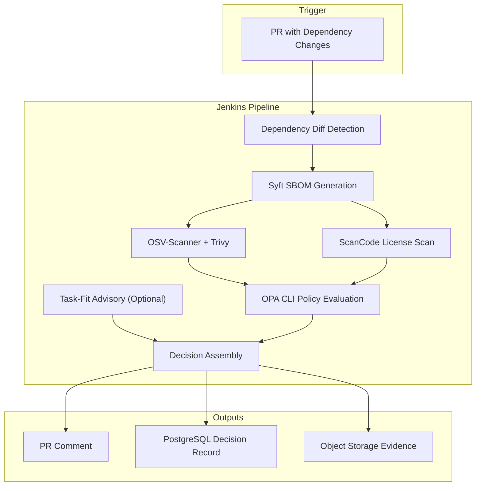

## 36.2 Target Architecture Diagram (Phase 2+)

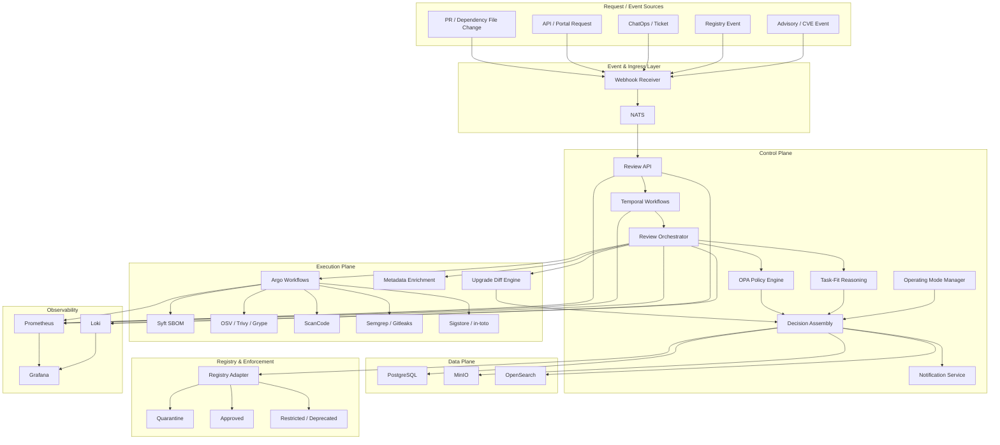

## 36.3 Jenkins PoC Pipeline Flow

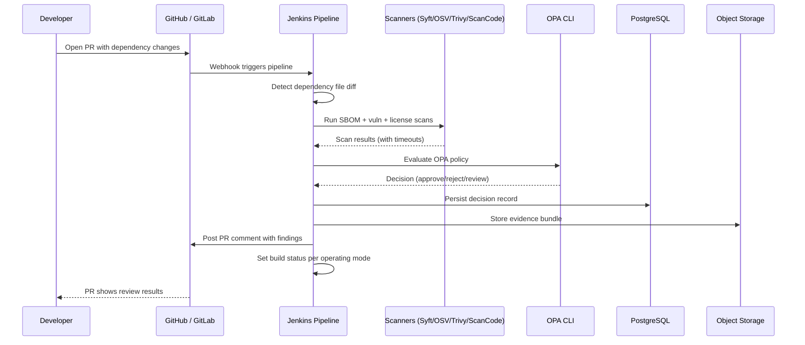

## 36.4 Operating Mode State Diagram

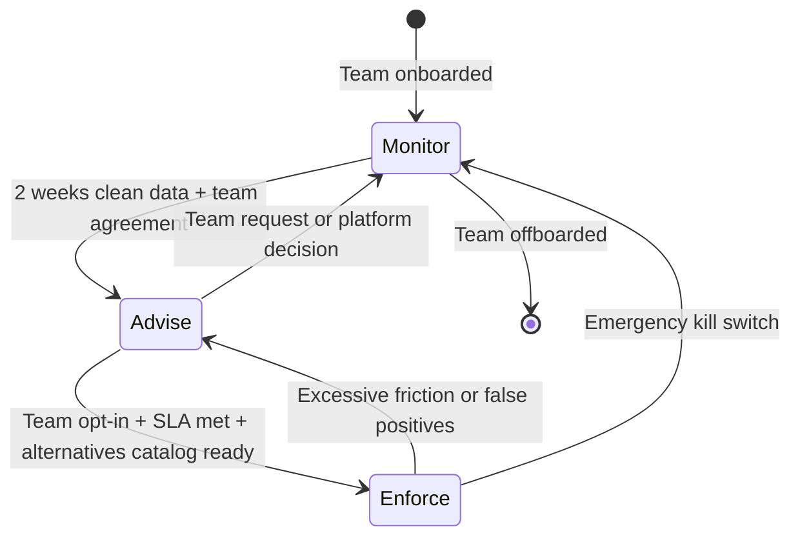

## 36.5 Temporal and Argo Interaction (Phase 2+)

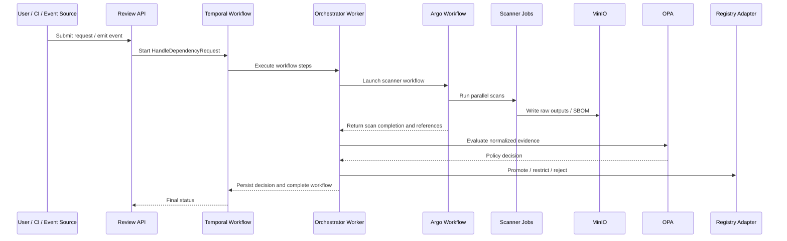

## 36.6 New Package Request Flow (Phase 1+)

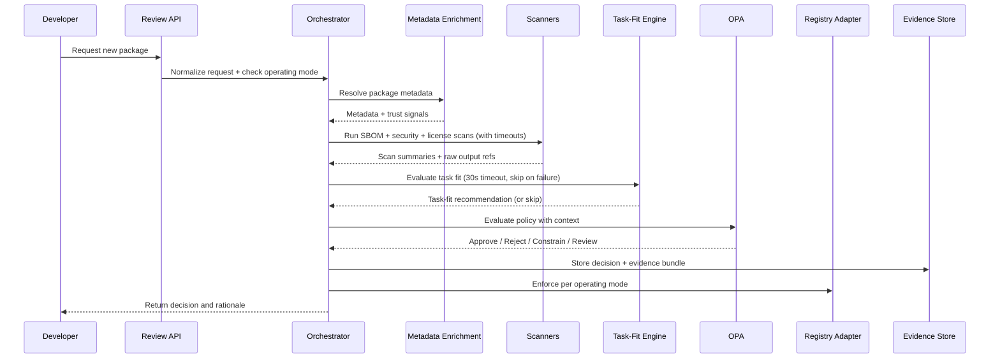

## 36.7 Version Upgrade Flow

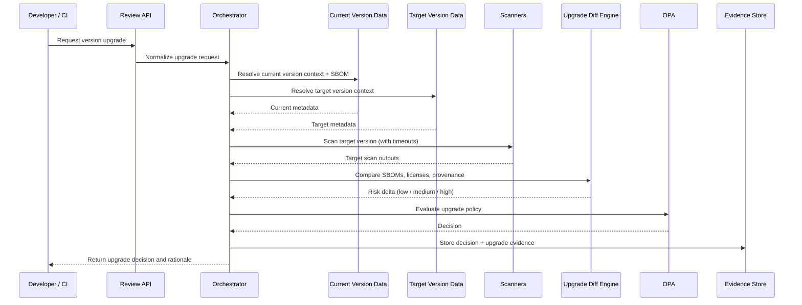

## 36.8 Decision Logic Flow

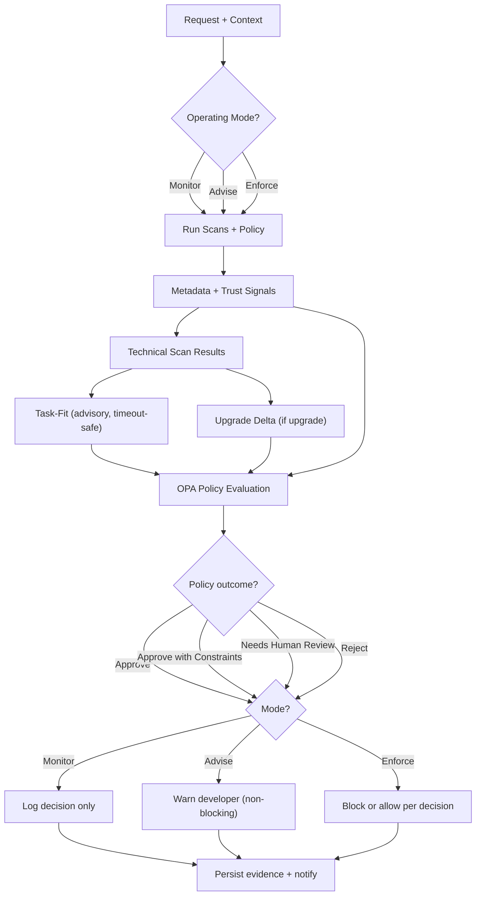

## 36.9 Repository State Transitions

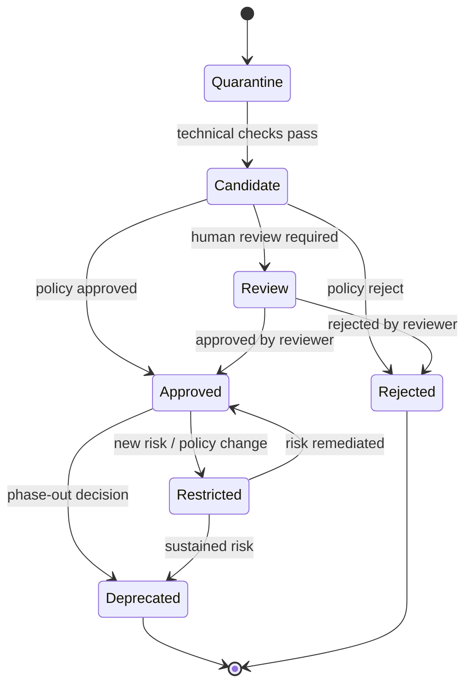

## 36.10 Epic Dependency Diagram

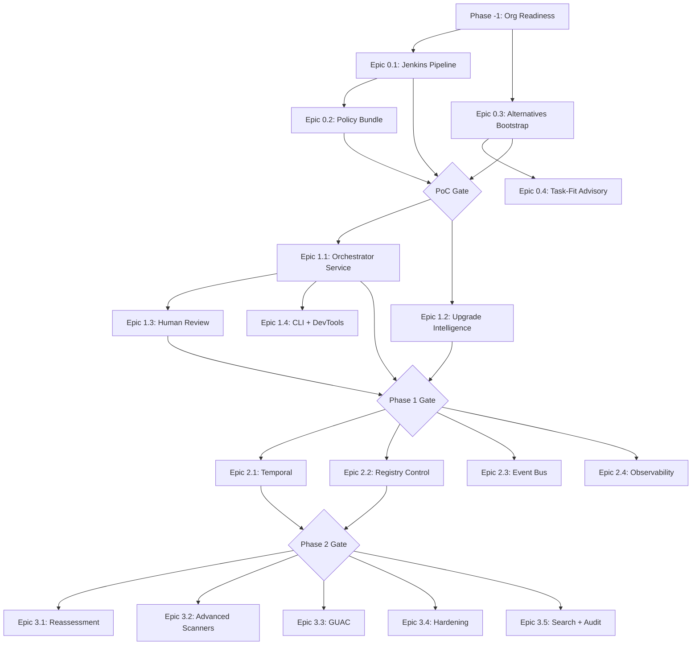

## 36.11 Phase Delivery Diagram

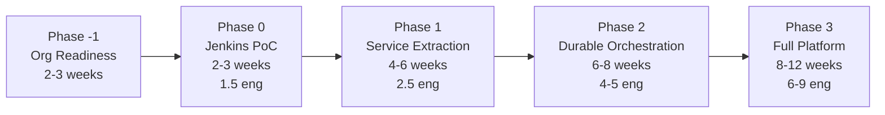

---

# 37. Acceptance Criteria

## 37.1 PoC Acceptance (Phase 0)

- pipeline runs on every PR with dependency changes for pilot team(s)
- auto-decision latency < 5 minutes (p95)
- false positive rate < 15%
- zero developer-reported build disruptions
- at least 2 actionable findings identified
- decision records are queryable in Postgres

## 37.2 Platform Acceptance (Phase 2)

- ≥50% of dependency changes flow through the system
- approval latency within SLA targets
- all decisions are auditable with evidence bundles
- enforce mode operational for at least 2 teams
- bypass rate < 5% of enforce-mode decisions
- emergency bypass tested and documented

## 37.3 Full Maturity (Phase 3)

- ≥90% of dependency changes flow through the system
- continuous reassessment operational
- registry-level enforcement for primary ecosystems
- rollback and restriction workflows function correctly
- < 1% unplanned bypass rate

---

# 38. Final Directive

This system should be built with the following mindset:

1. **Prove value in 2 weeks, not 6** — the Jenkins PoC is the first milestone
2. **Earn enforcement through trust** — monitor first, advise second, enforce only when the system is trusted
3. **Build only what doesn't exist** — compose existing scanners and tools; build the orchestration, policy, and reasoning layer
4. **Make policy explicit and versioned from day one**
5. **Optimize for developer trust and clarity** — every rejection must explain why and suggest what instead
6. **Treat upgrade risk as seriously as new dependencies**
7. **Size the team honestly** — this is not a side project
8. **Never silently halt developer productivity** — fail-open is the default; enforcement is earned

If executed correctly, this becomes a **central control plane for software risk**, not just a security tool.

---

End of document.
